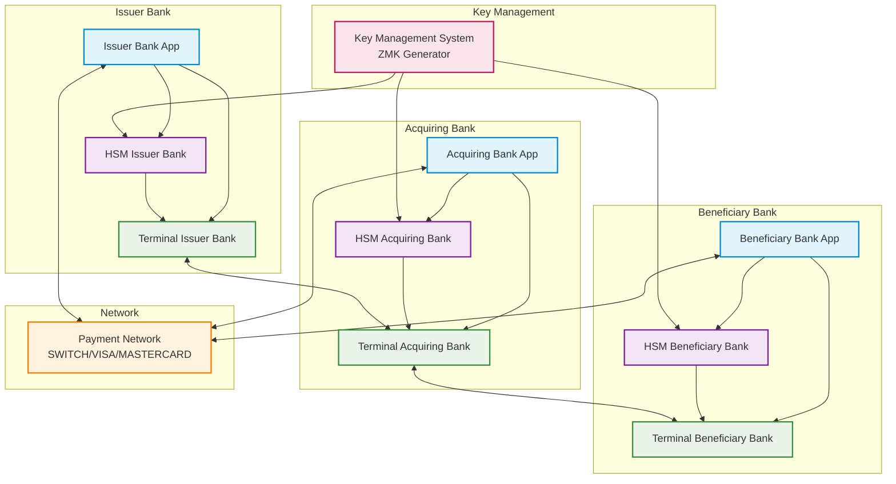
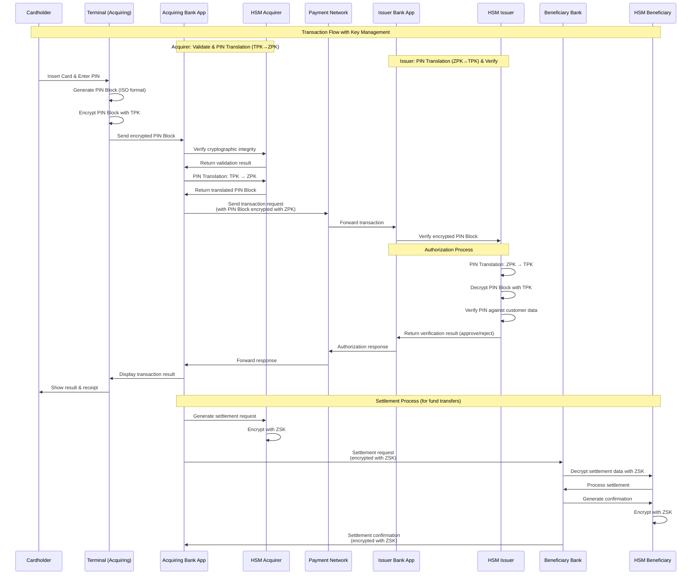

# HSM Simulator

<div align="center">

**Dikembangkan dengan bantuan asisten coding AI**

[](https://z.ai)
[](https://claude.ai/code)

*Proyek ini dikembangkan dengan bantuan GLM-4.5 oleh Z.ai dan Claude Code sebagai asisten coding AI*

</div>

## Deskripsi

Platform simulasi Hardware Security Module (HSM) yang komprehensif dibangun dengan Spring Boot, dilengkapi antarmuka web modern dengan Tailwind CSS dan Thymeleaf Layout Dialect. Simulator ini menyediakan antarmuka berbasis web untuk mengeksplorasi kemampuan HSM dan operasi kriptografi.

⚠️ **Untuk Kepentingan Edukasi**: Aplikasi ini merupakan simulator pembelajaran dan **tidak dimaksudkan untuk penggunaan production**.

## Quick Start

### 1. Clone & Setup
```bash
git clone <repository-url>
cd hsm-simulator
docker-compose up -d postgres
```

### 2. Build & Run
```bash
mvn clean install
mvn spring-boot:run
```

### 3. Access Application
Buka browser: `http://localhost:8080`

## 📖 Dokumentasi

### REST API Documentation
Dokumentasi lengkap REST API untuk integrasi workshop dan external systems tersedia di:
- **[API.md](API.md)** - Complete REST API reference dengan request/response examples, cURL commands, dan Java integration code

**API Endpoints:**
- `POST /api/hsm/pin/encrypt` - Encrypt PIN block and generate PVV (ISO-0, ISO-1, ISO-3, ISO-4)
- `POST /api/hsm/pin/generate-pinblock` - Generate PIN block encrypted with LMK
- `POST /api/hsm/pin/verify-with-translation` - Verify PIN using PIN block comparison (Method A)
- `POST /api/hsm/pin/verify-with-pvv` - Verify PIN using PVV method (Method B) ⭐ ISO 9564
- `POST /api/hsm/pin/verify` - Verify PIN against stored value (legacy)
- `POST /api/hsm/mac/generate` - Generate MAC (ISO9797-ALG3, HMAC-SHA256, CBC-MAC)
- `POST /api/hsm/mac/verify` - Verify MAC authenticity
- `POST /api/hsm/keys/initialize` - ⚡ Initialize complete key set for all banks (quick HSM setup)
- `POST /api/hsm/key/generate` - Generate cryptographic key (ZMK, TMK)
- `POST /api/hsm/key/exchange` - Exchange key between encryption domains

**Workshop Integration:**
HSM Simulator menyediakan REST API yang kompatibel dengan [training-spring-jpos-2025](https://github.com/artivisi/training-spring-jpos-2025) workshop:
- ✅ All required PIN formats (ISO-0, ISO-1, ISO-3, ISO-4)
- ✅ MAC operations untuk transaction integrity
- ✅ Key exchange untuk inter-bank communication
- ✅ ZAK dan TEK support (mapped to ZSK internally)
- ✅ Complete API documentation dengan Java integration examples

### Database Schema Documentation
Dokumentasi lengkap database schema dengan ERD, table specifications, dan sample queries:
- **[DATABASE.md](DATABASE.md)** - Complete database schema documentation

**Includes:**
- 14 tables dengan full column specifications
- Entity Relationship Diagram (ERD)
- Indexes dan performance optimization
- Sample queries untuk common operations
- Backup, security, dan monitoring guidelines

## Fitur Utama

### 🏗️ Platform Lengkap
- **Simulator HSM**: Platform simulasi Hardware Security Module yang komprehensif
- **Antarmuka Web Modern**: UI responsif dengan Tailwind CSS dan Thymeleaf Layout Dialect
- **Dashboard Interaktif**: Ringkasan operasi, statistik, dan monitoring real-time
- **Navigasi Intuitif**: Sidebar menu untuk akses cepat ke semua fitur HSM

### 🔐 Operasi Kriptografi
- **Manajemen Kunci**: Generate, import, export, dan rotasi kunci kriptografi
- **PIN Operations**: Pembuatan, verifikasi, dan translation PIN block (ISO-0, ISO-1, ISO-3, ISO-4)
  - PIN Generation: Generate random PIN dengan berbagai panjang (4-12 digit)
  - PIN Verification: Verifikasi PIN dengan tracking failed attempts
  - PIN Translation: Re-encrypt PIN dari satu key ke key lain dengan visualisasi 3-step
  - Format Support: ISO Format 0, 1, 3, 4 sesuai ISO 9564-1:2002
- **MAC Operations**: Message Authentication Code untuk integritas data
  - ISO 9797-1 Algorithm 3 (Retail MAC, compatible with ANSI X9.19)
  - HMAC-SHA256 untuk keamanan modern
  - CBC-MAC untuk legacy systems
  - MAC Generation & Verification dengan audit trail
- **REST API**: Endpoint lengkap untuk integrasi workshop dan external systems

### 🌐 Arsitektur Perbankan
- **Multi-Zone Support**: Manajemen kunci untuk Acquirer, Issuer, dan Switch
- **PIN Translation**: Konversi PIN antar zona dengan keamanan end-to-end
- **Key Ceremony**: Inisialisasi master key dengan threshold scheme (2-of-3)
- **Terminal Integration**: Komunikasi aman bank-terminal dengan TMK/TSK

### 📊 Monitoring & Keamanan
- **Audit Trail**: Logging lengkap untuk semua operasi kriptografi
- **Real-time Statistics**: Monitoring kinerja dan status kesehatan sistem
- **Security Controls**: Validasi, authentication, dan authorization
- **Educational Mode**: Visualisasi operasi kriptografi untuk pembelajaran

## Arsitektur Sistem Perbankan dengan HSM

### Diagram Arsitektur Lengkap



### Diagram Alur Transaksi dengan Key Management



### Penjelasan Arsitektur

Arsitektur ini menggambarkan ekosistem perbankan lengkap dengan tiga pihak utama:

1. **Issuer Bank**: Bank yang menerbitkan kartu kepada nasabah
2. **Acquiring Bank**: Bank yang menerima transaksi dari merchant
3. **Beneficiary Bank**: Bank penerima dana (dalam transfer antar bank)

### Hubungan Antar Komponen

1. **Internal Bank Connection**:
   - Setiap bank memiliki aplikasi internal yang terhubung dengan HSM-nya
   - HSM mengelola semua operasi kriptografi untuk terminal-terminal di bawahnya
   - Terminal-terminal terhubung langsung dengan HSM untuk keamanan

2. **Inter-Bank Connection**:
   - Semua bank terhubung melalui Payment Network (SWITCH/VISA/MASTERCARD)
   - Komunikasi antar bank menggunakan kombinasi ZMK, ZPK, dan ZSK:
     - **ZMK (Zone Master Key)**: Mengenkripsi kunci-kunci yang dikirim antar bank
     - **ZPK (Zone PIN Key)**: Mengenkripsi PIN-related data antar bank
     - **ZSK (Zone Session Key)**: Mengenkripsi data transaksi antar bank

3. **Key Management System**:
   - Sentral untuk menghasilkan dan mendistribusikan kunci ke semua HSM
   - Mengelola siklus hidup kunci kriptografi

### Fitur-Fitur HSM untuk Mendukung Transaksi

1. **PIN Management**:
   - PIN generation dan verification
   - PIN block format (ISO-0, ISO-1, ISO-3)
   - PIN translation antar format
   - PIN translation antar kunci (TPK↔ZPK)

2. **Key Management**:
   - Key generation (TMK, TSK, ZMK, ZPK)
   - Key storage dengan keamanan tingkat tinggi
   - Key rotation dan lifecycle management

3. **Cryptographic Operations**:
   - Encryption/Decryption (3DES, AES)
   - MAC generation dan verification
   - Digital signature

4. **Transaction Security**:
   - EMV cryptogram verification
   - ARQC (Application Request Cryptogram) generation
   - AAC (Application Authentication Cryptogram) verification

### Key Types Reference

HSM Simulator mendukung berbagai jenis kunci kriptografi untuk operasi perbankan:

| Key Type | Description | Usage | Parent Key |
|----------|-------------|-------|------------|
| **LMK** | Local Master Key | PIN storage encryption in HSM database | - |
| **TMK** | Terminal Master Key | Encrypts key distribution to terminals | - |
| **TPK** | Terminal PIN Key | Encrypts PIN blocks at terminal level | TMK |
| **TSK** | Terminal Security Key | MAC for terminal messages | TMK |
| **ZMK** | Zone Master Key | Encrypts inter-bank key exchanges | - |
| **ZPK** | Zone PIN Key | Protects PIN data between banks | ZMK |
| **ZSK** | Zone Session Key | Encrypts inter-bank messages | ZMK |
| **ZAK** | Zone Authentication Key | Workshop alias for ZSK (MAC operations) | ZMK |
| **TEK** | Traffic Encryption Key | Workshop alias for ZSK (message encryption) | ZMK |
| **KEK** | Key Encryption Key | Generic key encryption key | - |

**Note**: ZAK dan TEK keduanya di-map ke ZSK secara internal untuk kompatibilitas dengan workshop training.

### Penggunaan Kunci dalam Arsitektur

#### 1. TMK (Terminal Master Key)
- **Fungsi**: Kunci master untuk mengamankan distribusi kunci ke terminal
- **Penggunaan**:
  - Mengenkripsi kunci-kunci (TPK, TSK) saat dikirim ke terminal
  - Key exchange antara bank dan terminal
  - Mengamankan proses key loading ke terminal
- **Distribusi**: Diinject ke terminal secara aman oleh bank

#### 2. TPK (Terminal PIN Key)
- **Fungsi**: Kunci khusus untuk mengenkripsi PIN Block di terminal
- **Penggunaan**:
  - Mengenkripsi PIN Block sebelum dikirim ke bank
  - Digunakan untuk PIN Translation dari TPK ke ZPK untuk inter-bank
  - Melindungi PIN selama transmisi terminal ke bank
- **Distribusi**: Dikirim ke terminal dengan enkripsi TMK

#### 3. TSK (Terminal Security Key)
- **Fungsi**: Kunci keamanan untuk operasi spesifik terminal
- **Penggunaan**:
  - Generate MAC (Message Authentication Code)
  - Verifikasi integritas data dari terminal
  - Autentikasi terminal ke HSM
- **Distribusi**: Dikirim ke terminal dengan enkripsi TMK

#### 4. ZMK (Zone Master Key)
- **Fungsi**: Kunci master untuk mengamankan distribusi kunci antar bank
- **Penggunaan**:
  - Mengenkripsi kunci-kunci (ZPK, ZSK) saat dikirim antar bank
  - Key exchange protocol antar bank
- **Distribusi**: Diatur oleh payment network atau KMS sentral

#### 5. ZPK (Zone PIN Key)
- **Fungsi**: Kunci khusus untuk PIN-related data dalam komunikasi antar bank
- **Penggunaan**:
  - Mengenkripsi PIN block saat transfer antar bank
  - Melindungi PIN data selama proses inter-bank
- **Distribusi**: Dikirim antar bank dengan enkripsi ZMK

#### 6. ZSK (Zone Session Key)
- **Fungsi**: Kunci sesi untuk mengenkripsi data transaksi antar bank
- **Penggunaan**:
  - Mengenkripsi data transaksi non-PIN antar bank
  - Mengamankan settlement dan clearing data
- **Distribusi**: Dibuat per sesi transaksi dan dienkripsi dengan ZMK

### Alur Keamanan Transaksi

1. **PIN Entry**: PIN dikonversi menjadi PIN Block di terminal, kemudian dienkripsi dengan TPK di dalam terminal
2. **Authorization**: Acquirer memvalidasi integritas, melakukan PIN Translation (TPK→ZPK), dan meneruskan ke issuer. Issuer melakukan PIN Translation (ZPK→TPK), mendekripsi, dan memverifikasi PIN
3. **Key Exchange**: ZPK dan ZSK didistribusikan antar bank dengan enkripsi ZMK
4. **Inter-bank PIN Data**: PIN-related data antar bank dienkripsi dengan ZPK
5. **Inter-bank Transaction Data**: Data transaksi antar bank dienkripsi dengan ZSK
6. **Settlement**: Data settlement dienkripsi dengan ZSK untuk transfer dana antar bank
7. **Key Rotation**: Semua kunci dirotasi secara berkala untuk keamanan
8. **PIN Security**: PIN tidak pernah dikirim dalam bentuk plaintext antar sistem
9. **Key Hierarchy**: TMK mengamankan TPK/TSK, ZMK mengamankan ZPK/ZSK
10. **Acquirer Role**: HSM acquirer hanya memvalidasi integritas, tidak pernah mendekripsi PIN Block
11. **Issuer Role**: HSM issuer satu-satunya pihak yang mendekripsi dan memverifikasi PIN
12. **PIN Translation**: Konversi PIN Block antar kunci (TPK↔ZPK) untuk komunikasi inter-bank

Arsitektur ini memastikan keamanan end-to-end untuk semua transaksi perbankan dengan memanfaatkan HSM untuk semua operasi kriptografi kritis.

---

## 🎯 Features Summary

### ✅ Implemented Features

#### Core HSM Operations
- ✅ **Key Ceremony System** - Multi-custodian key initialization with Shamir's Secret Sharing (2-of-3 threshold)
- ✅ **Master Key Generation** - Generate ZMK and TMK with configurable key sizes (128, 192, 256 bits)
- ✅ **Key Hierarchy Management** - Parent-child relationships (TMK→TPK/TSK, ZMK→ZPK/ZSK)
- ✅ **Key Rotation** - Complete audit trail with rotation history

#### PIN Operations
- ✅ **PIN Generation** - Random PIN generation with lengths 4-12 digits
- ✅ **PIN Encryption** - Support for ISO-0, ISO-1, ISO-3, ISO-4 formats (ISO 9564-1:2002)
- ✅ **PIN Verification** - With failed attempt tracking and auto-blocking after 3 failures
- ✅ **PIN Translation** - Re-encrypt PIN from one key to another with educational visualization
- ✅ **PVV Generation** - PIN Verification Value for offline validation

#### MAC Operations
- ✅ **MAC Generation** - ISO 9797-1 Algorithm 3 (Retail MAC, ANSI X9.19 compatible)
- ✅ **HMAC-SHA256** - Modern MAC with SHA-256
- ✅ **CBC-MAC** - Legacy DES-based MAC
- ✅ **MAC Verification** - With attempt tracking and audit trail

#### REST API for Integration
- ✅ **PIN Encrypt API** - `/api/hsm/pin/encrypt` with all ISO formats
- ✅ **PIN Verify API** - `/api/hsm/pin/verify` with status tracking
- ✅ **MAC Generate API** - `/api/hsm/mac/generate` with 3 algorithms
- ✅ **MAC Verify API** - `/api/hsm/mac/verify` with tamper detection
- ✅ **Key Generate API** - `/api/hsm/key/generate` for ZMK and TMK
- ✅ **Key Exchange API** - `/api/hsm/key/exchange` with KCV calculation

#### Banking Infrastructure
- ✅ **Four-Party Model** - Banks (ISSUER, ACQUIRER, SWITCH, PROCESSOR)
- ✅ **Terminal Management** - ATM, POS, MPOS, E-COMMERCE terminal types
- ✅ **Zone Key Exchange** - Inter-bank key distribution tracking
- ✅ **Key Types Support** - LMK, TMK, TPK, TSK, ZMK, ZPK, ZSK, ZAK, TEK, KEK

#### User Interface
- ✅ **Web Dashboard** - Real-time statistics and monitoring
- ✅ **Key Management UI** - Generate, view, and manage keys
- ✅ **PIN Operations UI** - Generate, verify, and translate PINs with visualization
- ✅ **MAC Operations UI** - Generate and verify MACs with educational notes
- ✅ **Educational Mode** - Step-by-step visualization of cryptographic operations

#### Database & Documentation
- ✅ **PostgreSQL 17** - With Flyway migrations (5 versions)
- ✅ **14 Tables** - Complete schema for HSM operations
- ✅ **REST API Documentation** - Complete with examples (API.md)
- ✅ **Database Documentation** - Full schema reference (DATABASE.md)
- ✅ **User Manuals** - Step-by-step guides for all operations

## 📚 Dokumentasi Penggunaan dan Pengujian

Dokumentasi berikut diurutkan berdasarkan alur implementasi dari setup awal hingga operasi transaksi:

### 📚 User Manual
Dokumentasi lengkap untuk penggunaan HSM Simulator:

| Manual | Deskripsi | Link |
|--------|-----------|------|
| **Key Ceremony** | Prosedur lengkap inisialisasi dan pemulihan master key HSM menggunakan mekanisme 2-of-3 threshold scheme dengan Shamir's Secret Sharing. | [docs/user-manual/key-ceremony.md](docs/user-manual/key-ceremony.md) |
| **Terminal Key Management** | Panduan pengelolaan kunci terminal termasuk TMK (Terminal Master Key) dan TSK (Terminal Security Key) untuk komunikasi aman bank-terminal. | [docs/user-manual/terminal-key.md](docs/user-manual/terminal-key.md) |
| **Zone Key Management** | Panduan lengkap pengelolaan Zone Master Key (ZMK) dan Zone PIN Key (ZPK) untuk komunikasi antar bank dalam ekosistem perbankan. Termasuk PIN Translation dan implementasi keamanan transaksi lintas zona. | [docs/user-manual/zone-key.md](docs/user-manual/zone-key.md) |
| **PIN Block Operations** | Panduan lengkap operasi PIN block dengan format ISO-0, ISO-1, ISO-2, dan ISO-3. Termasuk enkripsi, dekripsi, dan verifikasi PIN block untuk transaksi perbankan. | [docs/user-manual/pinblock.md](docs/user-manual/pinblock.md) |

### 🧪 Test Scenario
Skenario pengujian untuk memvalidasi fitur-fitur HSM Simulator:

| Skenario | Deskripsi | Link |
|----------|-----------|------|
| **Key Ceremony Testing** | Skenario pengujian key ceremony dengan simulasi 3 custodian dan threshold 2-of-3. Termasuk inisialisasi dan pemulihan master key. | [docs/test-scenario/key-ceremony.md](docs/test-scenario/key-ceremony.md) |
| **Terminal Keys Testing** | Skenario pengujian manajemen kunci terminal untuk validasi keamanan komunikasi antara terminal dan HSM bank. | [docs/test-scenario/terminal-keys.md](docs/test-scenario/terminal-keys.md) |
| **Zone Key Testing** | Skenario pengujian komprehensif untuk Zone Key Management termasuk zone master key generation, PIN key derivation, PIN translation antar zone, dan end-to-end PIN verification dengan debug capabilities. | [docs/test-scenario/zone-key.md](docs/test-scenario/zone-key.md) |
| **PIN Block Testing** | Skenario pengujian komprehensif untuk operasi PIN block termasuk format validation, encryption/decryption, dan edge case testing. | [docs/test-scenario/pinblock.md](docs/test-scenario/pinblock.md) |

### 🔍 Fitur Dokumentasi

#### User Manual Features:
- **Step-by-step guidance**: Instruksi detail untuk setiap operasi HSM
- **Educational mode**: Penjelasan konsep kriptografi dengan visualisasi
- **Security considerations**: Best practice dan peringatan keamanan
- **Real-world examples**: Contoh implementasi dalam industri perbankan
- **Interface navigation**: Panduan penggunaan web interface

#### Test Scenario Features:
- **Comprehensive test cases**: Coverage untuk semua fitur utama
- **Edge case testing**: Pengujian kondisi boundary dan error handling
- **Integration testing**: Validasi end-to-end flow
- **Performance validation**: Pengujian throughput dan response time
- **Security validation**: Verifikasi keamanan implementasi

### 📖 Cara Menggunakan Dokumentasi

1. **Untuk Pembelajaran**: Mulai dari User Manual untuk memahami konsep dan cara penggunaan
2. **Untuk Pengujian**: Gunakan Test Scenario untuk memvalidasi implementasi
3. **Untuk Development**: Referensi dokumentasi saat mengembangkan fitur baru
4. **Untuk Troubleshooting**: Gunakan test scenario untuk debugging dan resolusi masalah

## Teknologi & Prasyarat

### Stack Teknologi
- **Backend**: Spring Boot 3.5.6 dengan Java 21
- **Security**: Spring Security dengan Form & Basic authentication
- **Frontend**: Thymeleaf dengan Layout Dialect + Tailwind CSS 4.1
- **Database**: PostgreSQL 17 dengan Flyway migrations
- **ORM**: Spring Data JPA dengan Hibernate 6.6.29
- **Cryptography**: Java Cryptography Architecture (JCA) - AES, DES, SHA-256, HMAC
- **Testing**: TestContainer (PostgreSQL), JUnit 5, Playwright untuk E2E testing
- **Build**: Maven dengan frontend-maven-plugin untuk npm integration

### Prasyarat Sistem
- Java 21+
- Maven 3.8+
- Node.js 24+ (untuk build Tailwind CSS)
- Docker & Docker Compose (untuk PostgreSQL dan testing)
- PostgreSQL 17

### Kebutuhan Pengetahuan
- Framework Java Spring Boot
- Pengembangan REST API
- Operasi database
- Pemahaman dasar konsep kriptografi
- Pengembangan web dengan HTML/CSS

## 💻 Development Setup

### Frontend Development (Tailwind CSS)

Tailwind CSS sudah terintegrasi dengan Maven melalui frontend-maven-plugin dan akan otomatis terkompilasi saat:
- `mvn clean install` - Build lengkap dengan kompilasi Tailwind
- `mvn spring-boot:run` - Jalankan aplikasi dengan kompilasi otomatis

Untuk development dengan hot reload (opsional):
```bash
# Install dependencies
npm install

# Start Tailwind CSS dalam mode watch (auto-kompilasi saat ada perubahan)
npm run build
```

Untuk production build manual (opsional):
```bash
npm run build-prod
```

### Manajemen Database
```bash
# Start PostgreSQL
docker-compose up -d postgres

# Lihat database logs
docker-compose logs postgres

# Stop database
docker-compose down
```

### Testing

Jalankan semua tes termasuk E2E tests:
```bash
mvn test
```

Jalankan hanya Playwright tests:
```bash
mvn test -Dtest=HomePageTest
```

Jalankan tes spesifik:
```bash
mvn test -Dtest=HomePageTest#shouldLoadHomepageWithCorrectTitle
```

## Project Structure

```
hsm-simulator/
├── README.md
├── pom.xml
├── package.json
├── tailwind.config.js
├── src/
│   ├── main/
│   │   ├── java/
│   │   │   └── com/artivisi/hsm/simulator/
│   │   │       ├── HsmSimulatorApplication.java
│   │   │       └── web/
│   │   │           └── HomeController.java
│   │   └── resources/
│   │       ├── static/
│   │       │   └── css/
│   │       │       ├── input.css
│   │       │       └── output.css
│   │       ├── templates/
│   │       │   ├── index.html
│   │       │   └── layout/
│   │       │       └── main.html
│   │       └── application.yml
│   └── test/
│       └── java/
│           └── com/artivisi/hsm/simulator/
│               └── playwright/
│                   ├── pages/
│                   │   ├── BasePage.java
│                   │   └── HomePage.java
│                   └── tests/
│                       └── HomePageTest.java
└── sql/
    └── migrations/
```

## Konfigurasi

### Konfigurasi Aplikasi
Konfigurasi utama ada di `src/main/resources/application.yml`.

### Konfigurasi Tailwind CSS
- `tailwind.config.js`: Konfigurasi Tailwind dengan content paths
- `src/main/resources/static/css/input.css`: Source CSS dengan Tailwind directives
- `src/main/resources/static/css/output.css`: CSS yang terkompilasi (auto-generated)

### Konfigurasi Database
Aplikasi menggunakan PostgreSQL dengan Flyway untuk database migrations. Konfigurasi dikelola melalui Spring Boot auto-configuration.

### Konfigurasi Testing
Proyek menggunakan TestContainer untuk database testing dan Playwright untuk end-to-end web testing:
- **PostgreSQL TestContainer**: Secara otomatis memulai instance PostgreSQL terisolasi untuk setiap test run
- **Playwright**: Menyediakan E2E testing dengan page object pattern untuk validasi web interface
- **Spring Boot Test**: Full integration testing dengan application context loading

## Troubleshooting

### Masalah Umum

1. **Port 8080 sudah digunakan**
   ```bash
   # Cari proses yang menggunakan port 8080
   lsof -i :8080

   # Hentikan proses atau ubah port aplikasi di application.yml
   ```

2. **Masalah koneksi database**
   ```bash
   # Periksa status PostgreSQL
   docker-compose ps

   # Restart PostgreSQL
   docker-compose restart postgres
   ```

3. **Tailwind CSS tidak terkompilasi**
   ```bash
   # Clean dan rebuild
   mvn clean install

   # Manual npm install
   npm install
   npm run build
   ```

4. **Perubahan frontend tidak terlihat**
   - Pastikan Tailwind CSS berjalan dalam mode watch (`npm run build`)
   - Periksa cache browser (hard refresh: Ctrl+Shift+R)
   - Verifikasi kompilasi CSS di `target/classes/static/css/output.css`

### Tips Debug
- Periksa aplikasi logs di console
- Verifikasi konektivitas database
- Pastikan semua dependensi terinstall dengan benar
- Test kompilasi Tailwind CSS secara terpisah

## Tujuan Pembelajaran

Proyek ini mendemonstrasikan:
- Struktur aplikasi Spring Boot modern
- Integrasi teknologi frontend (Tailwind CSS, Thymeleaf)
- Desain database dengan Flyway migrations
- Testing dengan TestContainer dan Playwright
- Otomasi build dengan Maven dan tools frontend

## Kontribusi

1. Fork repository
2. Buat feature branch
3. Buat perubahan Anda
4. Test secara menyeluruh
5. Submit pull request

## Lisensi

MIT License - lihat file LICENSE untuk detail

## Dukungan

Untuk pertanyaan atau dukungan:
- Buat issue di GitHub repository
- Periksa dokumentasi proyek
- Review codebase dan contoh

---

## Pengembangan dengan Bantuan AI

<div align="center">

[](https://z.ai)
[](https://claude.ai/code)

</div>

Proyek ini dikembangkan dengan bantuan **GLM-4.5 oleh Z.ai** dan **Claude Code oleh Anthropic** sebagai asisten coding AI.

**Highlight Proyek:**
- 🏗️ Aplikasi Spring Boot lengkap dengan antarmuka web modern
- 🎨 Integrasi Tailwind CSS 4.1 dengan proses build otomatis
- 📱 Desain responsif dengan Thymeleaf Layout Dialect
- 🗄️ Database PostgreSQL dengan Flyway migrations
- 🧪 Setup testing komprehensif dengan TestContainer dan Playwright
- 🚀 Konfigurasi build untuk development

⚠️ **Penting: Disclaimer**
- Kode yang dihasilkan AI **belum sepenuhnya diverifikasi** dan mungkin mengandung kesalahan
- Aplikasi ini **hanya simulator untuk kepentingan edukasi**
- **Tidak direkomendasikan untuk deployment di environment production**
- Harap ditinjau dan diuji secara menyeluruh sebelum digunakan
- Gunakan hanya untuk pembelajaran konsep HSM dan kriptografi