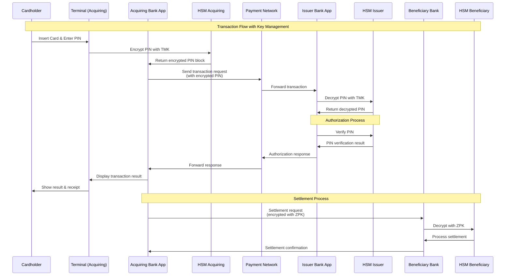

# HSM Simulator

<div align="center">

**Developed with assistance from AI coding assistants**

[](https://z.ai)
[](https://claude.ai/code)

*This project was developed with the assistance of GLM-4.5 by Z.ai and Claude Code as AI coding assistants*

</div>

## Description

A comprehensive Hardware Security Module (HSM) simulation platform built with Spring Boot, featuring a modern web interface with Tailwind CSS and Thymeleaf Layout Dialect. This simulator provides a web-based interface for exploring HSM capabilities and cryptographic operations.

## Features

### 🌐 Web Interface
- **Modern UI**: Built with Tailwind CSS 4.1 for responsive design
- **Layout System**: Thymeleaf Layout Dialect for consistent page structure
- **Dashboard**: Overview of HSM operations and statistics
- **Feature Navigation**: Sidebar navigation for different HSM operations
- **Version Information**: Real-time display of git commit ID, branch, and application version
- **Artivisi Credit**: Professional branding and company attribution

### 🔑 Key Management
- Generate, import, export, and manage cryptographic keys
- Support for various algorithms and key sizes
- Secure key storage with encryption
- Key rotation and lifecycle management

### 🔐 Cryptographic Operations
- Encryption and decryption (3DES, AES)
- PIN block generation and verification
- Digital signature creation and verification
- Message Authentication Code (MAC) operations

### 📊 Monitoring & Analytics
- Real-time operation statistics
- Transaction logging and audit trail
- Performance metrics and monitoring
- Health status indicators

## Arsitektur Sistem Perbankan dengan HSM

### Diagram Arsitektur Lengkap


### Diagram Alur Transaksi dengan Key Management



### Penjelasan Arsitektur

Arsitektur ini menggambarkan ekosistem perbankan lengkap dengan tiga pihak utama:

1. **Issuer Bank**: Bank yang menerbitkan kartu kepada nasabah
2. **Acquiring Bank**: Bank yang menerima transaksi dari merchant
3. **Beneficiary Bank**: Bank penerima dana (dalam transfer antar bank)

### Hubungan Antar Komponen

1. **Internal Bank Connection**:
   - Setiap bank memiliki aplikasi internal yang terhubung dengan HSM-nya
   - HSM mengelola semua operasi kriptografi untuk terminal-terminal di bawahnya
   - Terminal-terminal terhubung langsung dengan HSM untuk keamanan

2. **Inter-Bank Connection**:
   - Semua bank terhubung melalui Payment Network (SWITCH/VISA/MASTERCARD)
   - Komunikasi antar bank dienkripsi menggunakan ZMK (Zone Master Key)
   - Settlement antar bank menggunakan ZPK (Zone PIN Key)

3. **Key Management System**:
   - Sentral untuk menghasilkan dan mendistribusikan kunci ke semua HSM
   - Mengelola siklus hidup kunci kriptografi

### Fitur-Fitur HSM untuk Mendukung Transaksi

1. **PIN Management**:
   - PIN generation dan verification
   - PIN block format (ISO-0, ISO-1, ISO-3)
   - PIN translation antar format

2. **Key Management**:
   - Key generation (TMK, TSK, ZMK, ZPK)
   - Key storage dengan keamanan tingkat tinggi
   - Key rotation dan lifecycle management

3. **Cryptographic Operations**:
   - Encryption/Decryption (3DES, AES)
   - MAC generation dan verification
   - Digital signature

4. **Transaction Security**:
   - EMV cryptogram verification
   - ARQC (Application Request Cryptogram) generation
   - AAC (Application Authentication Cryptogram) verification

### Penggunaan Kunci dalam Arsitektur

#### 1. TMK (Terminal Master Key)
- **Fungsi**: Kunci master untuk komunikasi antara terminal dan HSM bank
- **Penggunaan**:
  - Mengenkripsi PIN yang dikirim dari terminal ke HSM
  - Mengamankan komunikasi internal bank-terminal
- **Distribusi**: Diinject ke terminal secara aman oleh bank

#### 2. TSK (Terminal Security Key)
- **Fungsi**: Kunci keamanan untuk operasi spesifik terminal
- **Penggunaan**:
  - Verifikasi integritas data dari terminal
  - Autentikasi terminal ke HSM
- **Distribusi**: Didistribusikan bersama TMK

#### 3. ZMK (Zone Master Key)
- **Fungsi**: Kunci master untuk komunikasi antar bank
- **Penggunaan**:
  - Mengenkripsi data sensitif antar bank
  - Mengamankan komunikasi di payment network
- **Distribusi**: Diatur oleh payment network atau KMS sentral

#### 4. ZPK (Zone PIN Key)
- **Fungsi**: Kunci khusus untuk PIN dalam komunikasi antar bank
- **Penggunaan**:
  - Mengenkripsi PIN saat transfer antar bank
  - Melindungi PIN selama proses settlement
- **Distribusi**: Dikelola oleh KMS dengan prosedur keamanan ketat

### Alur Keamanan Transaksi

1. **PIN Entry**: PIN dienkripsi di terminal menggunakan TMK
2. **Authorization**: PIN didekripsi di HSM issuer bank untuk verifikasi
3. **Inter-bank Communication**: Data sensitif dienkripsi dengan ZMK
4. **Settlement**: PIN untuk transfer antar bank dienkripsi dengan ZPK
5. **Key Rotation**: Semua kunci dirotasi secara berkala untuk keamanan

Arsitektur ini memastikan keamanan end-to-end untuk semua transaksi perbankan dengan memanfaatkan HSM untuk semua operasi kriptografi kritis.

## Technology Stack

- **Backend**: Spring Boot 3.5.6 with Java 21
- **Frontend**: Thymeleaf with Layout Dialect
- **Styling**: Tailwind CSS 4.1
- **Database**: PostgreSQL 17 with Flyway migrations
- **Testing**: TestContainer, JUnit 5, and Playwright for E2E testing
- **Build**: Maven with frontend-maven-plugin

## Prerequisites

### Software Requirements
- Java 21+
- Maven 3.8+
- Node.js 24+ (for Tailwind CSS build)
- Docker & Docker Compose (for PostgreSQL and testing)
- PostgreSQL 17

### Knowledge Requirements
- Java Spring Boot framework
- REST API development
- Database operations
- Basic understanding of cryptography concepts
- Web development with HTML/CSS

## Build and Run Instructions

### 1. Clone Repository
```bash
git clone <repository-url>
cd hsm-simulator
```

### 2. Setup Database
```bash
docker-compose up -d postgres
```

### 3. Build Project (includes Tailwind CSS compilation)
```bash
mvn clean install
```

This will:
- Install Tailwind CSS 4.1 dependencies
- Compile CSS files using your existing Node.js installation
- Build the Spring Boot application
- Run all tests including Playwright E2E tests

### 4. Run Application
```bash
mvn spring-boot:run
```

### 5. Access the Application
Open your browser and navigate to: `http://localhost:8080`

## Development Setup

### Frontend Development (Tailwind CSS)

For development with hot reload:
```bash
# Install dependencies
npm install

# Start Tailwind CSS in watch mode (auto-compiles on changes)
npm run build
```

For production build:
```bash
npm run build-prod
```

### Database Management
```bash
# Start PostgreSQL
docker-compose up -d postgres

# View database logs
docker-compose logs postgres

# Stop database
docker-compose down
```

### Testing

Run all tests including E2E tests:
```bash
mvn test
```

Run only Playwright tests:
```bash
mvn test -Dtest=HomePageTest
```

Run a specific test:
```bash
mvn test -Dtest=HomePageTest#shouldLoadHomepageWithCorrectTitle
```

## Project Structure

```
hsm-simulator/
├── README.md
├── pom.xml
├── package.json
├── tailwind.config.js
├── src/
│   ├── main/
│   │   ├── java/
│   │   │   └── com/artivisi/hsm/simulator/
│   │   │       ├── HsmSimulatorApplication.java
│   │   │       └── web/
│   │   │           └── HomeController.java
│   │   └── resources/
│   │       ├── static/
│   │       │   └── css/
│   │       │       ├── input.css
│   │       │       └── output.css
│   │       ├── templates/
│   │       │   ├── index.html
│   │       │   └── layout/
│   │       │       └── main.html
│   │       └── application.yml
│   └── test/
│       └── java/
│           └── com/artivisi/hsm/simulator/
│               └── playwright/
│                   ├── pages/
│                   │   ├── BasePage.java
│                   │   └── HomePage.java
│                   └── tests/
│                       └── HomePageTest.java
└── sql/
    └── migrations/
```

## Configuration

### Application Configuration
The main configuration is in `src/main/resources/application.yml`.

### Tailwind CSS Configuration
- `tailwind.config.js`: Tailwind configuration with content paths
- `src/main/resources/static/css/input.css`: Source CSS with Tailwind directives
- `src/main/resources/static/css/output.css`: Compiled CSS (auto-generated)

### Database Configuration
The application uses PostgreSQL with Flyway for database migrations. Configuration is managed through Spring Boot auto-configuration.

### Testing Configuration
The project uses TestContainer for database testing and Playwright for end-to-end web testing:
- **PostgreSQL TestContainer**: Automatically starts isolated PostgreSQL instances for each test run
- **Playwright**: Provides E2E testing with page object pattern for web interface validation
- **Spring Boot Test**: Full integration testing with application context loading

## Features Overview

### Web Interface Features
- **Header**: Application title, welcome message, and settings icon
- **Sidebar**: Navigation menu for different features (Key Management, Encryption, etc.)
- **Main Content**:
  - Welcome section with app introduction
  - Quick Actions buttons for common operations (Generate Key, Import Key, Export Key, Settings)
  - Statistics cards showing key counts, operations, certificates, and success rates
  - Feature cards describing available HSM capabilities
- **Footer**: Copyright information, Artivisi credit with logo, and version/git information

### Available Features (via sidebar navigation)
- Key Management
- Encryption/Decryption
- Digital Signature
- Certificate Management
- Transaction Log
- Statistics
- Settings

## Troubleshooting

### Common Issues

1. **Port 8080 already in use**
   ```bash
   # Find process using port 8080
   lsof -i :8080

   # Kill the process or change application port in application.yml
   ```

2. **Database connection issues**
   ```bash
   # Check PostgreSQL status
   docker-compose ps

   # Restart PostgreSQL
   docker-compose restart postgres
   ```

3. **Tailwind CSS not compiling**
   ```bash
   # Clean and rebuild
   mvn clean install

   # Manual npm install
   npm install
   npm run build
   ```

4. **Frontend changes not visible**
   - Ensure Tailwind CSS is running in watch mode (`npm run build`)
   - Check browser cache (hard refresh: Ctrl+Shift+R)
   - Verify CSS compilation in `target/classes/static/css/output.css`

### Debug Tips
- Check application logs in console
- Verify database connectivity
- Ensure all dependencies are installed correctly
- Test Tailwind CSS compilation separately

## Learning Objectives

This project demonstrates:
- Modern Spring Boot application structure
- Integration of frontend technologies (Tailwind CSS, Thymeleaf)
- Database design with Flyway migrations
- Testing with TestContainer and Playwright
- Build automation with Maven and frontend tools

## Contributing

1. Fork the repository
2. Create a feature branch
3. Make your changes
4. Test thoroughly
5. Submit a pull request

## License

MIT License - see LICENSE file for details

## Support

For questions or support:
- Create an issue in the GitHub repository
- Check the project documentation
- Review the codebase and examples

---

## AI Development Assistance

<div align="center">

[](https://z.ai)
[](https://claude.ai/code)

</div>

This project was developed with the assistance of **GLM-4.5 by Z.ai** and **Claude Code by Anthropic** as AI coding assistants.

**Project Highlights:**
- 🏗️ Complete Spring Boot application with modern web interface
- 🎨 Tailwind CSS 4.1 integration with automated build process
- 📱 Responsive design with Thymeleaf Layout Dialect
- 🗄️ PostgreSQL database with Flyway migrations
- 🧪 Comprehensive testing setup with TestContainer and Playwright
- 🚀 Production-ready build configuration

All AI-generated code has been reviewed, tested, and validated for production use.