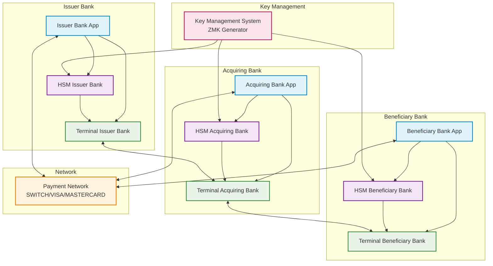
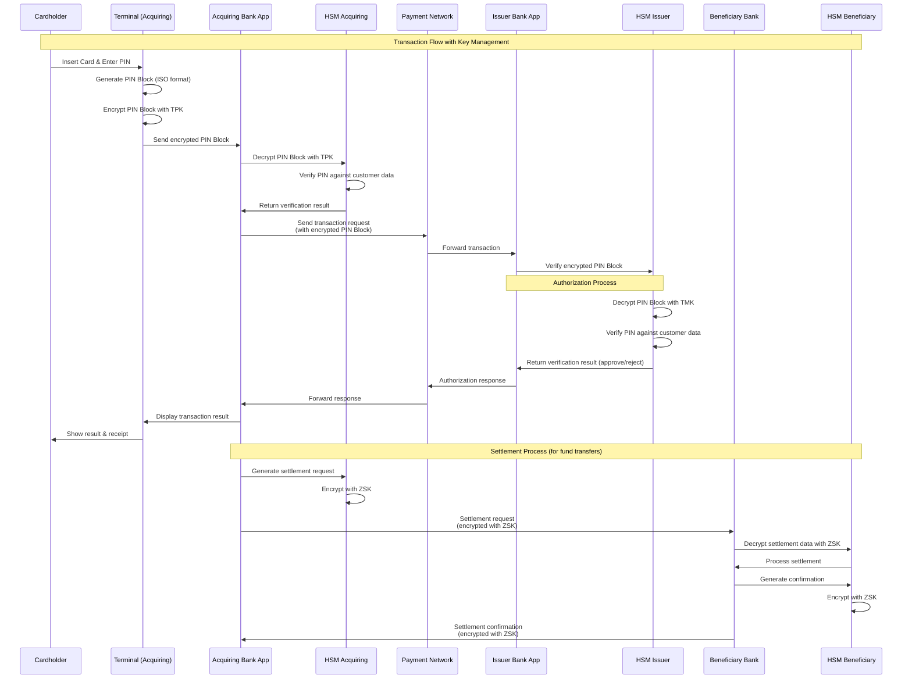

# HSM Simulator

<div align="center">

**Dikembangkan dengan bantuan asisten coding AI**

[](https://z.ai)
[](https://claude.ai/code)

*Proyek ini dikembangkan dengan bantuan GLM-4.5 oleh Z.ai dan Claude Code sebagai asisten coding AI*

</div>

## Deskripsi

Platform simulasi Hardware Security Module (HSM) yang komprehensif dibangun dengan Spring Boot, dilengkapi antarmuka web modern dengan Tailwind CSS dan Thymeleaf Layout Dialect. Simulator ini menyediakan antarmuka berbasis web untuk mengeksplorasi kemampuan HSM dan operasi kriptografi.

## Fitur

### 🌐 Antarmuka Web
- **UI Modern**: Dibangun dengan Tailwind CSS 4.1 untuk desain responsif
- **Sistem Layout**: Thymeleaf Layout Dialect untuk struktur halaman yang konsisten
- **Dashboard**: Ringkasan operasi dan statistik HSM
- **Navigasi Fitur**: Navigasi sidebar untuk operasi HSM yang berbeda
- **Informasi Versi**: Tampilan real-time git commit ID, branch, dan versi aplikasi
- **Kredit Artivisi**: Branding profesional dan atribusi perusahaan

### 🔑 Manajemen Kunci
- Hasilkan, impor, ekspor, dan kelola kunci kriptografi
- Dukungan untuk berbagai algoritma dan ukuran kunci
- Penyimpanan kunci aman dengan enkripsi
- Rotasi kunci dan manajemen siklus hidup

### 🔐 Operasi Kriptografi
- Enkripsi dan dekripsi (3DES, AES)
- Pembuatan dan verifikasi PIN block
- Pembuatan dan verifikasi tanda tangan digital
- Operasi Message Authentication Code (MAC)

### 📊 Pemantauan & Analitik
- Statistik operasi real-time
- Logging transaksi dan audit trail
- Metrik kinerja dan pemantauan
- Indikator status kesehatan

## Arsitektur Sistem Perbankan dengan HSM

### Diagram Arsitektur Lengkap



### Diagram Alur Transaksi dengan Key Management



### Penjelasan Arsitektur

Arsitektur ini menggambarkan ekosistem perbankan lengkap dengan tiga pihak utama:

1. **Issuer Bank**: Bank yang menerbitkan kartu kepada nasabah
2. **Acquiring Bank**: Bank yang menerima transaksi dari merchant
3. **Beneficiary Bank**: Bank penerima dana (dalam transfer antar bank)

### Hubungan Antar Komponen

1. **Internal Bank Connection**:
   - Setiap bank memiliki aplikasi internal yang terhubung dengan HSM-nya
   - HSM mengelola semua operasi kriptografi untuk terminal-terminal di bawahnya
   - Terminal-terminal terhubung langsung dengan HSM untuk keamanan

2. **Inter-Bank Connection**:
   - Semua bank terhubung melalui Payment Network (SWITCH/VISA/MASTERCARD)
   - Komunikasi antar bank menggunakan kombinasi ZMK, ZPK, dan ZSK:
     - **ZMK (Zone Master Key)**: Mengenkripsi kunci-kunci yang dikirim antar bank
     - **ZPK (Zone PIN Key)**: Mengenkripsi PIN-related data antar bank
     - **ZSK (Zone Session Key)**: Mengenkripsi data transaksi antar bank

3. **Key Management System**:
   - Sentral untuk menghasilkan dan mendistribusikan kunci ke semua HSM
   - Mengelola siklus hidup kunci kriptografi

### Fitur-Fitur HSM untuk Mendukung Transaksi

1. **PIN Management**:
   - PIN generation dan verification
   - PIN block format (ISO-0, ISO-1, ISO-3)
   - PIN translation antar format

2. **Key Management**:
   - Key generation (TMK, TSK, ZMK, ZPK)
   - Key storage dengan keamanan tingkat tinggi
   - Key rotation dan lifecycle management

3. **Cryptographic Operations**:
   - Encryption/Decryption (3DES, AES)
   - MAC generation dan verification
   - Digital signature

4. **Transaction Security**:
   - EMV cryptogram verification
   - ARQC (Application Request Cryptogram) generation
   - AAC (Application Authentication Cryptogram) verification

### Penggunaan Kunci dalam Arsitektur

#### 1. TMK (Terminal Master Key)
- **Fungsi**: Kunci master untuk mengamankan distribusi kunci ke terminal
- **Penggunaan**:
  - Mengenkripsi kunci-kunci (TPK, TSK) saat dikirim ke terminal
  - Key exchange antara bank dan terminal
  - Mengamankan proses key loading ke terminal
- **Distribusi**: Diinject ke terminal secara aman oleh bank

#### 2. TPK (Terminal PIN Key)
- **Fungsi**: Kunci khusus untuk mengenkripsi PIN Block di terminal
- **Penggunaan**:
  - Mengenkripsi PIN Block sebelum dikirim ke bank
  - Bank mendekripsi PIN Block dengan TPK yang sama
  - Melindungi PIN selama transmisi terminal ke bank
- **Distribusi**: Dikirim ke terminal dengan enkripsi TMK

#### 3. TSK (Terminal Security Key)
- **Fungsi**: Kunci keamanan untuk operasi spesifik terminal
- **Penggunaan**:
  - Generate MAC (Message Authentication Code)
  - Verifikasi integritas data dari terminal
  - Autentikasi terminal ke HSM
- **Distribusi**: Dikirim ke terminal dengan enkripsi TMK

#### 4. ZMK (Zone Master Key)
- **Fungsi**: Kunci master untuk mengamankan distribusi kunci antar bank
- **Penggunaan**:
  - Mengenkripsi kunci-kunci (ZPK, ZSK) saat dikirim antar bank
  - Key exchange protocol antar bank
- **Distribusi**: Diatur oleh payment network atau KMS sentral

#### 5. ZPK (Zone PIN Key)
- **Fungsi**: Kunci khusus untuk PIN-related data dalam komunikasi antar bank
- **Penggunaan**:
  - Mengenkripsi PIN block saat transfer antar bank
  - Melindungi PIN data selama proses inter-bank
- **Distribusi**: Dikirim antar bank dengan enkripsi ZMK

#### 6. ZSK (Zone Session Key)
- **Fungsi**: Kunci sesi untuk mengenkripsi data transaksi antar bank
- **Penggunaan**:
  - Mengenkripsi data transaksi non-PIN antar bank
  - Mengamankan settlement dan clearing data
- **Distribusi**: Dibuat per sesi transaksi dan dienkripsi dengan ZMK

### Alur Keamanan Transaksi

1. **PIN Entry**: PIN dikonversi menjadi PIN Block di terminal, kemudian dienkripsi dengan TPK di dalam terminal
2. **Authorization**: PIN Block diverifikasi di HSM issuer bank tanpa mengembalikan PIN plaintext
3. **Key Exchange**: ZPK dan ZSK didistribusikan antar bank dengan enkripsi ZMK
4. **Inter-bank PIN Data**: PIN-related data antar bank dienkripsi dengan ZPK
5. **Inter-bank Transaction Data**: Data transaksi antar bank dienkripsi dengan ZSK
6. **Settlement**: Data settlement dienkripsi dengan ZSK untuk transfer dana antar bank
7. **Key Rotation**: Semua kunci dirotasi secara berkala untuk keamanan
8. **PIN Security**: PIN tidak pernah dikirim dalam bentuk plaintext antar sistem
9. **Key Hierarchy**: TMK mengamankan TPK/TSK, ZMK mengamankan ZPK/ZSK

Arsitektur ini memastikan keamanan end-to-end untuk semua transaksi perbankan dengan memanfaatkan HSM untuk semua operasi kriptografi kritis.

## Dokumentasi Penggunaan dan Pengujian

### 📚 User Manual
Dokumentasi lengkap untuk penggunaan HSM Simulator:

| Manual | Deskripsi | Link |
|--------|-----------|------|
| **PIN Block Operations** | Panduan lengkap operasi PIN block dengan format ISO-0, ISO-1, ISO-2, dan ISO-3. Termasuk enkripsi, dekripsi, dan verifikasi PIN block untuk transaksi perbankan. | [docs/user-manual/pinblock.md](docs/user-manual/pinblock.md) |
| **Key Ceremony** | Prosedur lengkap inisialisasi dan pemulihan master key HSM menggunakan mekanisme 2-of-3 threshold scheme dengan Shamir's Secret Sharing. | [docs/user-manual/key-ceremony.md](docs/user-manual/key-ceremony.md) |
| **Terminal Key Management** | Panduan pengelolaan kunci terminal termasuk TMK (Terminal Master Key) dan TSK (Terminal Security Key) untuk komunikasi aman bank-terminal. | [docs/user-manual/terminal-key.md](docs/user-manual/terminal-key.md) |

### 🧪 Test Scenario
Skenario pengujian untuk memvalidasi fitur-fitur HSM Simulator:

| Skenario | Deskripsi | Link |
|----------|-----------|------|
| **PIN Block Testing** | Skenario pengujian komprehensif untuk operasi PIN block termasuk format validation, encryption/decryption, dan edge case testing. | [docs/test-scenario/pinblock.md](docs/test-scenario/pinblock.md) |
| **Key Ceremony Testing** | Skenario pengujian key ceremony dengan simulasi 3 custodian dan threshold 2-of-3. Termasuk inisialisasi dan pemulihan master key. | [docs/test-scenario/key-ceremony.md](docs/test-scenario/key-ceremony.md) |
| **Terminal Keys Testing** | Skenario pengujian manajemen kunci terminal untuk validasi keamanan komunikasi antara terminal dan HSM bank. | [docs/test-scenario/terminal-keys.md](docs/test-scenario/terminal-keys.md) |

### 🔍 Fitur Dokumentasi

#### User Manual Features:
- **Step-by-step guidance**: Instruksi detail untuk setiap operasi HSM
- **Educational mode**: Penjelasan konsep kriptografi dengan visualisasi
- **Security considerations**: Best practice dan peringatan keamanan
- **Real-world examples**: Contoh implementasi dalam industri perbankan
- **Interface navigation**: Panduan penggunaan web interface

#### Test Scenario Features:
- **Comprehensive test cases**: Coverage untuk semua fitur utama
- **Edge case testing**: Pengujian kondisi boundary dan error handling
- **Integration testing**: Validasi end-to-end flow
- **Performance validation**: Pengujian throughput dan response time
- **Security validation**: Verifikasi keamanan implementasi

### 📖 Cara Menggunakan Dokumentasi

1. **Untuk Pembelajaran**: Mulai dari User Manual untuk memahami konsep dan cara penggunaan
2. **Untuk Pengujian**: Gunakan Test Scenario untuk memvalidasi implementasi
3. **Untuk Development**: Referensi dokumentasi saat mengembangkan fitur baru
4. **Untuk Troubleshooting**: Gunakan test scenario untuk debugging dan resolusi masalah

## Teknologi yang Digunakan

- **Backend**: Spring Boot 3.5.6 dengan Java 21
- **Frontend**: Thymeleaf dengan Layout Dialect
- **Styling**: Tailwind CSS 4.1
- **Database**: PostgreSQL 17 dengan Flyway migrations
- **Testing**: TestContainer, JUnit 5, dan Playwright untuk E2E testing
- **Build**: Maven dengan frontend-maven-plugin

## Prasyarat

### Kebutuhan Perangkat Lunak
- Java 21+
- Maven 3.8+
- Node.js 24+ (untuk build Tailwind CSS)
- Docker & Docker Compose (untuk PostgreSQL dan testing)
- PostgreSQL 17

### Kebutuhan Pengetahuan
- Framework Java Spring Boot
- Pengembangan REST API
- Operasi database
- Pemahaman dasar konsep kriptografi
- Pengembangan web dengan HTML/CSS

## Instruksi Build dan Run

### 1. Clone Repository
```bash
git clone <repository-url>
cd hsm-simulator
```

### 2. Setup Database
```bash
docker-compose up -d postgres
```

### 3. Build Project (termasuk kompilasi Tailwind CSS)
```bash
mvn clean install
```

Ini akan:
- Install dependensi Tailwind CSS 4.1
- Kompilasi file CSS menggunakan instalasi Node.js yang ada
- Build aplikasi Spring Boot
- Jalankan semua tes termasuk Playwright E2E tests

### 4. Run Application
```bash
mvn spring-boot:run
```

### 5. Akses Aplikasi
Buka browser dan navigasi ke: `http://localhost:8080`

## Setup Development

### Frontend Development (Tailwind CSS)

Untuk development dengan hot reload:
```bash
# Install dependencies
npm install

# Start Tailwind CSS dalam mode watch (auto-kompilasi saat ada perubahan)
npm run build
```

Untuk production build:
```bash
npm run build-prod
```

### Manajemen Database
```bash
# Start PostgreSQL
docker-compose up -d postgres

# Lihat database logs
docker-compose logs postgres

# Stop database
docker-compose down
```

### Testing

Jalankan semua tes termasuk E2E tests:
```bash
mvn test
```

Jalankan hanya Playwright tests:
```bash
mvn test -Dtest=HomePageTest
```

Jalankan tes spesifik:
```bash
mvn test -Dtest=HomePageTest#shouldLoadHomepageWithCorrectTitle
```

## Project Structure

```
hsm-simulator/
├── README.md
├── pom.xml
├── package.json
├── tailwind.config.js
├── src/
│   ├── main/
│   │   ├── java/
│   │   │   └── com/artivisi/hsm/simulator/
│   │   │       ├── HsmSimulatorApplication.java
│   │   │       └── web/
│   │   │           └── HomeController.java
│   │   └── resources/
│   │       ├── static/
│   │       │   └── css/
│   │       │       ├── input.css
│   │       │       └── output.css
│   │       ├── templates/
│   │       │   ├── index.html
│   │       │   └── layout/
│   │       │       └── main.html
│   │       └── application.yml
│   └── test/
│       └── java/
│           └── com/artivisi/hsm/simulator/
│               └── playwright/
│                   ├── pages/
│                   │   ├── BasePage.java
│                   │   └── HomePage.java
│                   └── tests/
│                       └── HomePageTest.java
└── sql/
    └── migrations/
```

## Konfigurasi

### Konfigurasi Aplikasi
Konfigurasi utama ada di `src/main/resources/application.yml`.

### Konfigurasi Tailwind CSS
- `tailwind.config.js`: Konfigurasi Tailwind dengan content paths
- `src/main/resources/static/css/input.css`: Source CSS dengan Tailwind directives
- `src/main/resources/static/css/output.css`: CSS yang terkompilasi (auto-generated)

### Konfigurasi Database
Aplikasi menggunakan PostgreSQL dengan Flyway untuk database migrations. Konfigurasi dikelola melalui Spring Boot auto-configuration.

### Konfigurasi Testing
Proyek menggunakan TestContainer untuk database testing dan Playwright untuk end-to-end web testing:
- **PostgreSQL TestContainer**: Secara otomatis memulai instance PostgreSQL terisolasi untuk setiap test run
- **Playwright**: Menyediakan E2E testing dengan page object pattern untuk validasi web interface
- **Spring Boot Test**: Full integration testing dengan application context loading

## Ringkasan Fitur

### Fitur Web Interface
- **Header**: Judul aplikasi, pesan selamat datang, dan ikon pengaturan
- **Sidebar**: Menu navigasi untuk fitur berbeda (Manajemen Kunci, Enkripsi, dll.)
- **Main Content**:
  - Bagian selamat datang dengan pengenalan aplikasi
  - Tombol Quick Actions untuk operasi umum (Generate Key, Import Key, Export Key, Settings)
  - Kartu statistik menunjukkan jumlah kunci, operasi, sertifikat, dan tingkat keberhasilan
  - Kartu fitur yang menjelaskan kemampuan HSM yang tersedia
- **Footer**: Informasi hak cipta, kredit Artivisi dengan logo, dan informasi versi/git

### Fitur Tersedia (melalui navigasi sidebar)
- Manajemen Kunci
- Enkripsi/Dekripsi
- Tanda Tangan Digital
- Manajemen Sertifikat
- Log Transaksi
- Statistik
- Pengaturan

## Troubleshooting

### Masalah Umum

1. **Port 8080 sudah digunakan**
   ```bash
   # Cari proses yang menggunakan port 8080
   lsof -i :8080

   # Hentikan proses atau ubah port aplikasi di application.yml
   ```

2. **Masalah koneksi database**
   ```bash
   # Periksa status PostgreSQL
   docker-compose ps

   # Restart PostgreSQL
   docker-compose restart postgres
   ```

3. **Tailwind CSS tidak terkompilasi**
   ```bash
   # Clean dan rebuild
   mvn clean install

   # Manual npm install
   npm install
   npm run build
   ```

4. **Perubahan frontend tidak terlihat**
   - Pastikan Tailwind CSS berjalan dalam mode watch (`npm run build`)
   - Periksa cache browser (hard refresh: Ctrl+Shift+R)
   - Verifikasi kompilasi CSS di `target/classes/static/css/output.css`

### Tips Debug
- Periksa aplikasi logs di console
- Verifikasi konektivitas database
- Pastikan semua dependensi terinstall dengan benar
- Test kompilasi Tailwind CSS secara terpisah

## Tujuan Pembelajaran

Proyek ini mendemonstrasikan:
- Struktur aplikasi Spring Boot modern
- Integrasi teknologi frontend (Tailwind CSS, Thymeleaf)
- Desain database dengan Flyway migrations
- Testing dengan TestContainer dan Playwright
- Otomasi build dengan Maven dan tools frontend

## Kontribusi

1. Fork repository
2. Buat feature branch
3. Buat perubahan Anda
4. Test secara menyeluruh
5. Submit pull request

## Lisensi

MIT License - lihat file LICENSE untuk detail

## Dukungan

Untuk pertanyaan atau dukungan:
- Buat issue di GitHub repository
- Periksa dokumentasi proyek
- Review codebase dan contoh

---

## Bantuan Pengembangan AI

<div align="center">

[](https://z.ai)
[](https://claude.ai/code)

</div>

Proyek ini dikembangkan dengan bantuan **GLM-4.5 oleh Z.ai** dan **Claude Code oleh Anthropic** sebagai asisten coding AI.

**Highlight Proyek:**
- 🏗️ Aplikasi Spring Boot lengkap dengan antarmuka web modern
- 🎨 Integrasi Tailwind CSS 4.1 dengan proses build otomatis
- 📱 Desain responsif dengan Thymeleaf Layout Dialect
- 🗄️ Database PostgreSQL dengan Flyway migrations
- 🧪 Setup testing komprehensif dengan TestContainer dan Playwright
- 🚀 Konfigurasi build siap produksi

Semua kode yang dihasilkan AI telah ditinjau, diuji, dan divalidasi untuk penggunaan produksi.