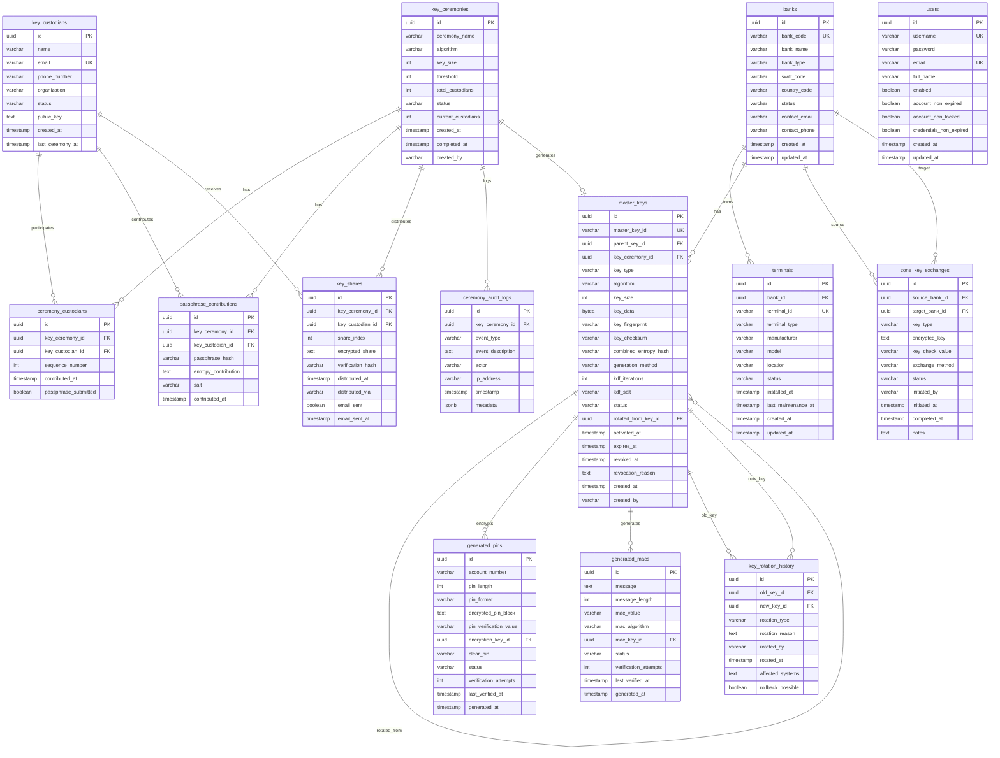

# HSM Simulator Database Schema Documentation

## Overview

The HSM Simulator uses PostgreSQL 17 with Flyway migrations for version control. The database schema is designed to support cryptographic key management, PIN operations, MAC generation, and multi-custodian key ceremonies following banking industry standards.

**Database Name**: `hsm_simulator`
**JDBC URL**: `jdbc:postgresql://localhost:5432/hsm_simulator`
**Migration Tool**: Flyway
**ORM**: Spring Data JPA with Hibernate

---

## Schema Versions

| Version | Description | File |
|---------|-------------|------|
| V1 | Complete schema creation - all tables for HSM functionality | `V1__create_schema.sql` |
| V2 | Sample data - banks, terminals, custodians, users | `V2__insert_sample_data.sql` |

**Note**: Schema uses `id_tablename` FK convention (e.g., `id_bank`, `id_key_ceremony`) instead of `tablename_id`.

---

## Entity Relationship Diagram



---

## Tables

### 1. key_ceremonies

Stores information about key ceremony sessions for generating master keys using Shamir's Secret Sharing.

**Purpose**: Orchestrates multi-custodian key initialization and restoration processes.

| Column | Type | Constraints | Description |
|--------|------|-------------|-------------|
| id | UUID | PRIMARY KEY | Unique ceremony identifier |
| ceremony_name | VARCHAR(255) | NOT NULL | Human-readable ceremony name |
| algorithm | VARCHAR(50) | NOT NULL | Encryption algorithm (AES, 3DES) |
| key_size | INTEGER | NOT NULL | Key size in bits (128, 192, 256) |
| threshold | INTEGER | NOT NULL | Minimum custodians needed (k in k-of-n) |
| total_custodians | INTEGER | NOT NULL | Total number of custodians (n in k-of-n) |
| status | VARCHAR(20) | NOT NULL, CHECK | INITIALIZED, IN_PROGRESS, COMPLETED, FAILED |
| current_custodians | INTEGER | DEFAULT 0 | Number of custodians who contributed |
| created_at | TIMESTAMP | NOT NULL | Creation timestamp |
| completed_at | TIMESTAMP | | Completion timestamp |
| created_by | VARCHAR(255) | | User who initiated ceremony |

**Indexes**:
- `idx_key_ceremonies_status` on `status`

**Related Tables**: `ceremony_custodians`, `master_keys`, `ceremony_audit_logs`

---

### 2. key_custodians

Stores information about individuals authorized to hold key shares.

**Purpose**: Manages key custodians for multi-party key ceremonies.

| Column | Type | Constraints | Description |
|--------|------|-------------|-------------|
| id | UUID | PRIMARY KEY | Unique custodian identifier |
| name | VARCHAR(255) | NOT NULL | Full name |
| email | VARCHAR(255) | UNIQUE, NOT NULL | Email address |
| phone_number | VARCHAR(20) | | Contact phone |
| organization | VARCHAR(255) | | Organization/department |
| status | VARCHAR(20) | NOT NULL, CHECK | ACTIVE, SUSPENDED, REVOKED |
| public_key | TEXT | | Public key for secure communication |
| created_at | TIMESTAMP | NOT NULL | Creation timestamp |
| last_ceremony_at | TIMESTAMP | | Last ceremony participation |

**Indexes**:
- `idx_key_custodians_email` on `email`
- `idx_key_custodians_status` on `status`

**Related Tables**: `ceremony_custodians`

---

### 3. ceremony_custodians

Junction table linking custodians to ceremonies with their contributions.

**Purpose**: Tracks custodian participation and passphrase contributions in key ceremonies.

| Column | Type | Constraints | Description |
|--------|------|-------------|-------------|
| id | UUID | PRIMARY KEY | Unique record identifier |
| key_ceremony_id | UUID | FOREIGN KEY, NOT NULL | Reference to key_ceremonies |
| key_custodian_id | UUID | FOREIGN KEY, NOT NULL | Reference to key_custodians |
| sequence_number | INTEGER | NOT NULL | Order of contribution (1 to n) |
| contributed_at | TIMESTAMP | | Timestamp of contribution |
| passphrase_submitted | BOOLEAN | DEFAULT FALSE | Whether passphrase submitted |

**Indexes**:
- `idx_ceremony_custodians_ceremony` on `key_ceremony_id`
- `idx_ceremony_custodians_custodian` on `key_custodian_id`

**Unique Constraint**: `(key_ceremony_id, sequence_number)`

---

### 4. passphrase_contributions

Stores individual custodian entropy contributions for key derivation.

**Purpose**: Captures passphrase entropy for KDF during key ceremony.

| Column | Type | Constraints | Description |
|--------|------|-------------|-------------|
| id | UUID | PRIMARY KEY | Unique contribution identifier |
| key_ceremony_id | UUID | FOREIGN KEY, NOT NULL | Reference to key_ceremonies |
| key_custodian_id | UUID | FOREIGN KEY, NOT NULL | Reference to key_custodians |
| passphrase_hash | VARCHAR(255) | NOT NULL | SHA-256 hash of passphrase |
| entropy_contribution | TEXT | NOT NULL | Encrypted entropy data |
| salt | VARCHAR(255) | NOT NULL | Unique salt for KDF |
| contributed_at | TIMESTAMP | NOT NULL | Contribution timestamp |

**Indexes**:
- `idx_passphrase_contributions_ceremony` on `key_ceremony_id`

---

### 5. key_shares

Stores individual key shares distributed to custodians using Shamir's Secret Sharing.

**Purpose**: Implements k-of-n threshold cryptography for key recovery.

| Column | Type | Constraints | Description |
|--------|------|-------------|-------------|
| id | UUID | PRIMARY KEY | Unique share identifier |
| key_ceremony_id | UUID | FOREIGN KEY, NOT NULL | Reference to key_ceremonies |
| key_custodian_id | UUID | FOREIGN KEY, NOT NULL | Reference to key_custodians |
| share_index | INTEGER | NOT NULL | Share index (1 to n) |
| encrypted_share | TEXT | NOT NULL | Encrypted share data |
| verification_hash | VARCHAR(255) | NOT NULL | Hash for integrity verification |
| distributed_at | TIMESTAMP | NOT NULL | Distribution timestamp |
| distributed_via | VARCHAR(50) | | Distribution method (EMAIL, IN_PERSON) |
| email_sent | BOOLEAN | DEFAULT FALSE | Whether email was sent |
| email_sent_at | TIMESTAMP | | Email send timestamp |

**Indexes**:
- `idx_key_shares_ceremony` on `key_ceremony_id`
- `idx_key_shares_custodian` on `key_custodian_id`

---

### 6. master_keys

Unified table storing all cryptographic keys in the HSM hierarchy.

**Purpose**: Central repository for all master keys including HSM master, TMK, TPK, TSK, ZMK, ZPK, ZSK, LMK, and KEK.

| Column | Type | Constraints | Description |
|--------|------|-------------|-------------|
| id | UUID | PRIMARY KEY | Unique key identifier |
| master_key_id | VARCHAR(255) | UNIQUE, NOT NULL | Human-readable key ID |
| parent_key_id | UUID | FOREIGN KEY | Reference to parent key (hierarchy) |
| key_ceremony_id | UUID | FOREIGN KEY | Reference to key_ceremonies |
| key_type | VARCHAR(50) | NOT NULL, CHECK | LMK, TMK, TPK, TSK, ZMK, ZPK, ZSK, KEK |
| algorithm | VARCHAR(50) | NOT NULL | Encryption algorithm (AES, 3DES) |
| key_size | INTEGER | NOT NULL | Key size in bits |
| key_data | BYTEA | NOT NULL | Key material (plaintext for educational purposes) |
| key_fingerprint | VARCHAR(255) | NOT NULL | SHA-256 fingerprint |
| key_checksum | VARCHAR(255) | NOT NULL | MD5 checksum (KCV) |
| combined_entropy_hash | VARCHAR(255) | NOT NULL | Combined entropy hash |
| generation_method | VARCHAR(50) | NOT NULL | RANDOM, DERIVED, CEREMONY |
| kdf_iterations | INTEGER | DEFAULT 0 | PBKDF2 iterations for derived keys |
| kdf_salt | VARCHAR(255) | | Salt for key derivation |
| status | VARCHAR(20) | NOT NULL, CHECK | ACTIVE, EXPIRED, REVOKED, SUSPENDED |
| rotated_from_key_id | UUID | FOREIGN KEY | Reference to previous key (rotation) |
| activated_at | TIMESTAMP | | Activation timestamp |
| expires_at | TIMESTAMP | | Expiration timestamp |
| revoked_at | TIMESTAMP | | Revocation timestamp |
| revocation_reason | TEXT | | Reason for revocation |
| created_at | TIMESTAMP | NOT NULL | Creation timestamp |
| created_by | VARCHAR(255) | | User who created key |

**Key Types**:
- **LMK**: Local Master Key - PIN storage encryption
- **TMK**: Terminal Master Key - Terminal key distribution
- **TPK**: Terminal PIN Key - Terminal PIN operations (child of TMK)
- **TSK**: Terminal Security Key - Terminal MAC operations (child of TMK)
- **ZMK**: Zone Master Key - Inter-bank key exchange
- **ZPK**: Zone PIN Key - Inter-bank PIN operations (child of ZMK)
- **ZSK**: Zone Session Key - Inter-bank message encryption (child of ZMK)
- **KEK**: Key Encryption Key - Generic key wrapping

**Indexes**:
- `idx_master_keys_type` on `key_type`
- `idx_master_keys_status` on `status`
- `idx_master_keys_parent` on `parent_key_id`
- `idx_master_keys_ceremony` on `key_ceremony_id`

**Key Hierarchy**:
```
LMK (root)
TMK (root) ─┬─ TPK (child)
            └─ TSK (child)
ZMK (root) ─┬─ ZPK (child)
            └─ ZSK (child)
```

---

### 7. generated_pins

Stores generated PIN blocks with encryption and verification data.

**Purpose**: Manages PIN generation, encryption, and verification for card accounts.

| Column | Type | Constraints | Description |
|--------|------|-------------|-------------|
| id | UUID | PRIMARY KEY | Unique PIN record identifier |
| account_number | VARCHAR(19) | NOT NULL | Primary Account Number (PAN) |
| pin_length | INTEGER | NOT NULL | Length of PIN (4-12 digits) |
| pin_format | VARCHAR(20) | NOT NULL, CHECK | ISO-0, ISO-1, ISO-3, ISO-4 |
| encrypted_pin_block | TEXT | NOT NULL | Encrypted PIN block (hex) |
| pin_verification_value | VARCHAR(10) | NOT NULL | PVV for offline verification |
| encryption_key_id | UUID | FOREIGN KEY, NOT NULL | Reference to master_keys (LMK/TPK/ZPK) |
| clear_pin | VARCHAR(12) | | Clear PIN (educational only) |
| status | VARCHAR(20) | NOT NULL, CHECK | ACTIVE, BLOCKED, EXPIRED |
| verification_attempts | INTEGER | DEFAULT 0 | Failed verification attempts |
| last_verified_at | TIMESTAMP | | Last verification timestamp |
| generated_at | TIMESTAMP | NOT NULL | Generation timestamp |

**PIN Formats**:
- **ISO-0**: `0L[PIN][F...] XOR [0000][12 PAN digits]` - Most common
- **ISO-1**: `1L[PIN][Random]` - No PAN required
- **ISO-3**: `3L[PIN][Random] XOR [0000][12 PAN digits]`
- **ISO-4**: `4L[PIN][Random hex] XOR [0000][12 PAN digits]` - Workshop format

**Indexes**:
- `idx_generated_pins_account` on `account_number`
- `idx_generated_pins_status` on `status`
- `idx_generated_pins_key` on `encryption_key_id`

**Security Note**: `clear_pin` stored for educational purposes only. Production HSM never stores clear PINs.

---

### 8. generated_macs

Stores generated MACs for message authentication and integrity verification.

**Purpose**: Manages MAC generation and verification for transaction messages.

| Column | Type | Constraints | Description |
|--------|------|-------------|-------------|
| id | UUID | PRIMARY KEY | Unique MAC record identifier |
| message | TEXT | NOT NULL | Original message authenticated |
| message_length | INTEGER | NOT NULL | Message length in bytes |
| mac_value | VARCHAR(64) | NOT NULL | Generated MAC (16 hex chars) |
| mac_algorithm | VARCHAR(50) | NOT NULL, CHECK | AES-CMAC, AES-CMAC-128, AES-CMAC-256, HMAC-SHA256, HMAC-SHA256-FULL |
| mac_key_id | UUID | FOREIGN KEY, NOT NULL | Reference to master_keys (TSK/ZSK) |
| status | VARCHAR(20) | NOT NULL, CHECK | ACTIVE, EXPIRED, REVOKED |
| verification_attempts | INTEGER | DEFAULT 0 | Verification attempt counter |
| last_verified_at | TIMESTAMP | | Last verification timestamp |
| generated_at | TIMESTAMP | NOT NULL | Generation timestamp |

**MAC Algorithms**:
- **AES-CMAC**: AES-CMAC with 64-bit output (NIST SP 800-38B, banking standard)
- **AES-CMAC-128**: AES-CMAC with 128-bit output (full MAC value)
- **AES-CMAC-256**: AES-CMAC with 256-bit output (extended security)
- **HMAC-SHA256**: HMAC with SHA-256, 64-bit output (modern alternative)
- **HMAC-SHA256-FULL**: HMAC with SHA-256, 256-bit output (full hash)

**Indexes**:
- `idx_generated_macs_mac_key_id` on `mac_key_id`
- `idx_generated_macs_status` on `status`
- `idx_generated_macs_generated_at` on `generated_at`
- `idx_generated_macs_message_key` on `(message, mac_key_id)`

---

### 9. banks

Stores information about financial institutions in the payment network.

**Purpose**: Represents organizations in the four-party card processing model.

| Column | Type | Constraints | Description |
|--------|------|-------------|-------------|
| id | UUID | PRIMARY KEY | Unique bank identifier |
| bank_code | VARCHAR(20) | UNIQUE, NOT NULL | Bank identification code |
| bank_name | VARCHAR(255) | NOT NULL | Official bank name |
| bank_type | VARCHAR(20) | NOT NULL, CHECK | ISSUER, ACQUIRER, SWITCH, PROCESSOR |
| swift_code | VARCHAR(11) | | SWIFT/BIC code |
| country_code | VARCHAR(3) | NOT NULL | ISO 3166-1 alpha-3 country code |
| status | VARCHAR(20) | NOT NULL, CHECK | ACTIVE, SUSPENDED, INACTIVE |
| contact_email | VARCHAR(255) | | Contact email |
| contact_phone | VARCHAR(20) | | Contact phone |
| created_at | TIMESTAMP | NOT NULL | Creation timestamp |
| updated_at | TIMESTAMP | | Last update timestamp |

**Bank Types**:
- **ISSUER**: Issues cards to cardholders
- **ACQUIRER**: Accepts card payments for merchants
- **SWITCH**: Routes transactions between banks
- **PROCESSOR**: Processes transactions on behalf of banks

**Indexes**:
- `idx_banks_code` on `bank_code`
- `idx_banks_type` on `bank_type`
- `idx_banks_status` on `status`

---

### 10. terminals

Stores information about payment terminals (ATM, POS, MPOS, E-commerce).

**Purpose**: Represents terminal endpoints that require cryptographic keys.

| Column | Type | Constraints | Description |
|--------|------|-------------|-------------|
| id | UUID | PRIMARY KEY | Unique terminal identifier |
| bank_id | UUID | FOREIGN KEY, NOT NULL | Reference to banks |
| terminal_id | VARCHAR(50) | UNIQUE, NOT NULL | Terminal identification |
| terminal_type | VARCHAR(20) | NOT NULL, CHECK | ATM, POS, MPOS, E_COMMERCE |
| manufacturer | VARCHAR(100) | | Terminal manufacturer |
| model | VARCHAR(100) | | Terminal model |
| location | VARCHAR(255) | | Physical or logical location |
| status | VARCHAR(20) | NOT NULL, CHECK | ACTIVE, INACTIVE, MAINTENANCE |
| installed_at | TIMESTAMP | | Installation timestamp |
| last_maintenance_at | TIMESTAMP | | Last maintenance timestamp |
| created_at | TIMESTAMP | NOT NULL | Creation timestamp |
| updated_at | TIMESTAMP | | Last update timestamp |

**Terminal Types**:
- **ATM**: Automated Teller Machine
- **POS**: Point of Sale terminal
- **MPOS**: Mobile Point of Sale
- **E_COMMERCE**: Online payment gateway

**Indexes**:
- `idx_terminals_bank` on `bank_id`
- `idx_terminals_terminal_id` on `terminal_id`
- `idx_terminals_type` on `terminal_type`
- `idx_terminals_status` on `status`

---

### 11. zone_key_exchanges

Tracks inter-bank cryptographic key exchanges.

**Purpose**: Audit trail for key distribution between financial institutions.

| Column | Type | Constraints | Description |
|--------|------|-------------|-------------|
| id | UUID | PRIMARY KEY | Unique exchange identifier |
| source_bank_id | UUID | FOREIGN KEY, NOT NULL | Sending bank |
| target_bank_id | UUID | FOREIGN KEY, NOT NULL | Receiving bank |
| key_type | VARCHAR(50) | NOT NULL | ZMK, ZPK, ZSK |
| encrypted_key | TEXT | NOT NULL | Key encrypted under target ZMK |
| key_check_value | VARCHAR(10) | NOT NULL | KCV for verification |
| exchange_method | VARCHAR(50) | NOT NULL | MANUAL, AUTOMATED |
| status | VARCHAR(20) | NOT NULL, CHECK | PENDING, COMPLETED, FAILED, REJECTED |
| initiated_by | VARCHAR(255) | NOT NULL | User who initiated exchange |
| initiated_at | TIMESTAMP | NOT NULL | Initiation timestamp |
| completed_at | TIMESTAMP | | Completion timestamp |
| notes | TEXT | | Additional notes |

**Indexes**:
- `idx_zone_key_exchanges_source` on `source_bank_id`
- `idx_zone_key_exchanges_target` on `target_bank_id`
- `idx_zone_key_exchanges_status` on `status`

---

### 12. key_rotation_history

Complete audit trail of cryptographic key rotation activities.

**Purpose**: Compliance and security audit logging for key lifecycle management.

| Column | Type | Constraints | Description |
|--------|------|-------------|-------------|
| id | UUID | PRIMARY KEY | Unique rotation record identifier |
| old_key_id | UUID | FOREIGN KEY, NOT NULL | Reference to previous key |
| new_key_id | UUID | FOREIGN KEY, NOT NULL | Reference to new key |
| rotation_type | VARCHAR(50) | NOT NULL | SCHEDULED, EMERGENCY, COMPROMISED |
| rotation_reason | TEXT | NOT NULL | Reason for rotation |
| rotated_by | VARCHAR(255) | NOT NULL | User who performed rotation |
| rotated_at | TIMESTAMP | NOT NULL | Rotation timestamp |
| affected_systems | TEXT | | Systems affected by rotation |
| rollback_possible | BOOLEAN | DEFAULT TRUE | Whether rollback is possible |

**Indexes**:
- `idx_key_rotation_history_old` on `old_key_id`
- `idx_key_rotation_history_new` on `new_key_id`
- `idx_key_rotation_history_rotated_at` on `rotated_at`

---

### 13. ceremony_audit_logs

Detailed audit logging for key ceremony activities.

**Purpose**: Forensic audit trail for compliance and security investigations.

| Column | Type | Constraints | Description |
|--------|------|-------------|-------------|
| id | UUID | PRIMARY KEY | Unique log entry identifier |
| key_ceremony_id | UUID | FOREIGN KEY, NOT NULL | Reference to key_ceremonies |
| event_type | VARCHAR(50) | NOT NULL | CEREMONY_STARTED, CONTRIBUTION, etc. |
| event_description | TEXT | NOT NULL | Detailed event description |
| actor | VARCHAR(255) | | User or system performing action |
| ip_address | VARCHAR(45) | | IP address of actor |
| timestamp | TIMESTAMP | NOT NULL | Event timestamp |
| metadata | JSONB | | Additional event metadata |

**Indexes**:
- `idx_ceremony_audit_logs_ceremony` on `key_ceremony_id`
- `idx_ceremony_audit_logs_event_type` on `event_type`
- `idx_ceremony_audit_logs_timestamp` on `timestamp`

---

### 14. users

User authentication and authorization for HSM access control.

**Purpose**: Spring Security user management for web UI and API access.

| Column | Type | Constraints | Description |
|--------|------|-------------|-------------|
| id | UUID | PRIMARY KEY | Unique user identifier |
| username | VARCHAR(50) | UNIQUE, NOT NULL | Login username |
| password | VARCHAR(255) | NOT NULL | BCrypt hashed password |
| email | VARCHAR(255) | UNIQUE, NOT NULL | Email address |
| full_name | VARCHAR(255) | NOT NULL | Full name |
| enabled | BOOLEAN | DEFAULT TRUE | Account enabled flag |
| account_non_expired | BOOLEAN | DEFAULT TRUE | Account not expired |
| account_non_locked | BOOLEAN | DEFAULT TRUE | Account not locked |
| credentials_non_expired | BOOLEAN | DEFAULT TRUE | Credentials not expired |
| created_at | TIMESTAMP | NOT NULL | Creation timestamp |
| updated_at | TIMESTAMP | | Last update timestamp |

**Indexes**:
- `idx_users_username` on `username`
- `idx_users_email` on `email`

**Security**: Passwords stored using BCrypt with strength 10.

---

## Data Types

### Common Types

- **UUID**: Universally Unique Identifier (128-bit)
- **VARCHAR(n)**: Variable-length character string (max n characters)
- **TEXT**: Variable-length character string (unlimited)
- **INTEGER**: 32-bit signed integer
- **BOOLEAN**: True/false value
- **TIMESTAMP**: Date and time with timezone
- **BYTEA**: Binary data (variable length)
- **JSONB**: Binary JSON data (indexed)

---

## Indexes Strategy

### Performance Indexes
- Foreign keys automatically indexed
- Status columns indexed for filtering
- Timestamp columns indexed for range queries
- Composite indexes for common query patterns

### Audit Indexes
- Created/updated timestamps
- User/actor columns
- Event type columns

---

## Constraints

### Check Constraints

**Status Fields**:
- `key_ceremonies.status`: INITIALIZED, IN_PROGRESS, COMPLETED, FAILED
- `key_custodians.status`: ACTIVE, SUSPENDED, REVOKED
- `master_keys.status`: ACTIVE, EXPIRED, REVOKED, SUSPENDED
- `generated_pins.status`: ACTIVE, BLOCKED, EXPIRED
- `generated_macs.status`: ACTIVE, EXPIRED, REVOKED
- `banks.status`: ACTIVE, SUSPENDED, INACTIVE
- `terminals.status`: ACTIVE, INACTIVE, MAINTENANCE

**Enum Fields**:
- `master_keys.key_type`: LMK, TMK, TPK, TSK, ZMK, ZPK, ZSK, KEK
- `banks.bank_type`: ISSUER, ACQUIRER, SWITCH, PROCESSOR
- `terminals.terminal_type`: ATM, POS, MPOS, E_COMMERCE
- `generated_pins.pin_format`: ISO-0, ISO-1, ISO-3, ISO-4
- `generated_macs.mac_algorithm`: AES-CMAC, AES-CMAC-128, AES-CMAC-256, HMAC-SHA256, HMAC-SHA256-FULL

### Foreign Key Constraints
All foreign key relationships enforce referential integrity with ON DELETE restrictions.

---

## Sample Queries

### Get Active Master Keys by Type
```sql
SELECT master_key_id, key_type, algorithm, key_size, status, activated_at
FROM master_keys
WHERE key_type = 'ZMK' AND status = 'ACTIVE'
ORDER BY activated_at DESC;
```

### Get Key Hierarchy
```sql
WITH RECURSIVE key_tree AS (
  SELECT id, master_key_id, parent_key_id, key_type, 0 as level
  FROM master_keys
  WHERE parent_key_id IS NULL

  UNION ALL

  SELECT m.id, m.master_key_id, m.parent_key_id, m.key_type, kt.level + 1
  FROM master_keys m
  INNER JOIN key_tree kt ON m.parent_key_id = kt.id
)
SELECT * FROM key_tree ORDER BY level, master_key_id;
```

### Get Active PINs Count by Status
```sql
SELECT status, COUNT(*) as count
FROM generated_pins
GROUP BY status
ORDER BY count DESC;
```

### Get MAC Verification Statistics
```sql
SELECT
  mac_algorithm,
  COUNT(*) as total_macs,
  SUM(verification_attempts) as total_verifications,
  AVG(verification_attempts) as avg_verifications_per_mac
FROM generated_macs
WHERE status = 'ACTIVE'
GROUP BY mac_algorithm;
```

### Get Key Ceremony Status
```sql
SELECT
  kc.ceremony_name,
  kc.status,
  kc.threshold,
  kc.current_custodians,
  COUNT(DISTINCT cc.key_custodian_id) as custodians_joined,
  COUNT(pc.id) as passphrases_submitted
FROM key_ceremonies kc
LEFT JOIN ceremony_custodians cc ON kc.id = cc.key_ceremony_id
LEFT JOIN passphrase_contributions pc ON kc.id = pc.key_ceremony_id
WHERE kc.status = 'IN_PROGRESS'
GROUP BY kc.id, kc.ceremony_name, kc.status, kc.threshold, kc.current_custodians;
```

---

## Backup and Recovery

### Database Backup
```bash
pg_dump -h localhost -U hsm_user -d hsm_simulator > hsm_backup_$(date +%Y%m%d).sql
```

### Database Restore
```bash
psql -h localhost -U hsm_user -d hsm_simulator < hsm_backup_20251026.sql
```

### Point-in-Time Recovery
Enable WAL archiving in postgresql.conf for PITR capability.

---

## Security Considerations

### Sensitive Data

⚠️ **Educational Simulator**: This database stores sensitive cryptographic material in software. Production HSM would:

1. **Never Store Clear Keys**: Key material protected by hardware security module
2. **No Clear PINs**: PIN values never stored in clear text
3. **Encrypted Backups**: All backups encrypted at rest
4. **Access Logging**: All database access logged and monitored
5. **Network Isolation**: Database in isolated network segment
6. **Least Privilege**: Each service uses minimal required permissions

### Encryption at Rest

For production:
```sql
-- Enable transparent data encryption
ALTER DATABASE hsm_simulator SET encryption = true;
```

### Row-Level Security

Example for multi-tenant isolation:
```sql
ALTER TABLE master_keys ENABLE ROW LEVEL SECURITY;

CREATE POLICY bank_isolation ON master_keys
  USING (bank_id = current_setting('app.current_bank')::uuid);
```

---

## Monitoring

### Key Metrics to Monitor

1. **Key Rotation Age**: Alert if keys exceed rotation period
2. **Failed PIN Attempts**: Monitor for brute force attacks
3. **MAC Verification Failures**: Detect message tampering
4. **Ceremony Progress**: Track stuck or abandoned ceremonies
5. **Database Size**: Monitor growth patterns
6. **Query Performance**: Identify slow queries

### Monitoring Queries

```sql
-- Keys nearing expiration
SELECT master_key_id, key_type, expires_at,
       expires_at - CURRENT_TIMESTAMP as time_remaining
FROM master_keys
WHERE status = 'ACTIVE'
  AND expires_at < CURRENT_TIMESTAMP + INTERVAL '30 days'
ORDER BY expires_at;

-- Blocked PINs
SELECT account_number, verification_attempts, generated_at
FROM generated_pins
WHERE status = 'BLOCKED'
ORDER BY generated_at DESC;
```

---

## Migration Management

### Running Migrations
```bash
mvn clean compile  # Flyway runs automatically
```

### Creating New Migration
```bash
# Create file: src/main/resources/db/migration/V3__description.sql
```

### Migration Naming Convention
```
V{version}__{description}.sql
Examples:
  V1__create_schema.sql
  V2__insert_sample_data.sql
  V3__add_new_feature.sql
```

---

## Additional Resources

- **Flyway Documentation**: https://flywaydb.org/documentation
- **PostgreSQL 17 Docs**: https://www.postgresql.org/docs/17/
- **Spring Data JPA**: https://spring.io/projects/spring-data-jpa
- **HSM Standards**: ISO 11568, ANSI X9.24

---

**Last Updated**: October 27, 2025
**Schema Version**: V2
**Database**: PostgreSQL 17.6
