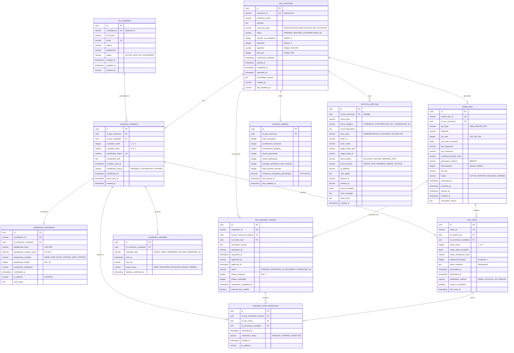

# HSM Simulator - Database Schema Documentation

## Overview

This document describes the database schema for the HSM Simulator Key Ceremony functionality. The schema supports a 2-of-3 threshold scheme using Shamir's Secret Sharing for master key generation and recovery.

## Database Diagram

## Key Features

- **UUID Primary Keys**: All tables use UUID as primary keys for better distribution and security
- **FK Naming Convention**: Foreign keys follow the pattern `id_tablename`
- **Audit Trail**: Comprehensive logging of all ceremony activities
- **Statistics Tracking**: Real-time ceremony progress monitoring
- **Restoration Support**: Key restoration using threshold scheme

## Ceremony Workflow Diagram

## Database Tables

### 1. key_custodians

Stores information about individuals who serve as key custodians.

**Columns:**
- `id` (UUID, PK): Unique identifier
- `custodian_id` (VARCHAR(50), UNIQUE): Business identifier
- `full_name` (VARCHAR(255)): Full name
- `email` (VARCHAR(255), UNIQUE): Email address
- `phone` (VARCHAR(50)): Phone number
- `department` (VARCHAR(100)): Department
- `status` (VARCHAR(20)): Status (ACTIVE, INACTIVE, SUSPENDED)
- `created_at` (TIMESTAMP): Creation timestamp
- `updated_at` (TIMESTAMP): Last update timestamp
- `created_by` (VARCHAR(100)): Creator identifier

**Indexes:**
- `idx_custodian_email` on `email`
- `idx_custodian_status` on `status`

---

### 2. key_ceremonies

Tracks the lifecycle and configuration of key ceremonies.

**Columns:**
- `id` (UUID, PK): Unique identifier
- `ceremony_id` (VARCHAR(50), UNIQUE): Business identifier
- `ceremony_name` (VARCHAR(255)): Ceremony name
- `purpose` (TEXT): Purpose description
- `ceremony_type` (VARCHAR(50)): Type (INITIALIZATION, RESTORATION, KEY_ROTATION)
- `status` (VARCHAR(50)): Current status
- `number_of_custodians` (INTEGER): Total custodians (default: 3)
- `threshold` (INTEGER): Minimum shares needed (default: 2)
- `algorithm` (VARCHAR(50)): Encryption algorithm (default: AES-256)
- `key_size` (INTEGER): Key size in bits (default: 256)
- `contribution_deadline` (TIMESTAMP): Deadline for contributions
- `started_at` (TIMESTAMP): Start time
- `completed_at` (TIMESTAMP): Completion time
- `cancelled_at` (TIMESTAMP): Cancellation time
- `cancellation_reason` (TEXT): Reason for cancellation
- `created_by` (VARCHAR(100)): Creator
- `last_modified_by` (VARCHAR(100)): Last modifier

**Status Values:**
- PENDING
- AWAITING_CONTRIBUTIONS
- PARTIAL_CONTRIBUTIONS
- GENERATING_KEY
- COMPLETED
- CANCELLED
- EXPIRED

**Indexes:**
- `idx_ceremony_status` on `status`
- `idx_ceremony_type` on `ceremony_type`
- `idx_ceremony_created_at` on `started_at`

---

### 3. ceremony_custodians

Links custodians to ceremonies with their specific roles and contribution status.

**Columns:**
- `id` (UUID, PK): Unique identifier
- `id_key_ceremony` (UUID, FK): References key_ceremonies
- `id_key_custodian` (UUID, FK): References key_custodians
- `custodian_order` (INTEGER): Order in ceremony (1, 2, 3)
- `custodian_label` (VARCHAR(10)): Label (A, B, C)
- `contribution_token` (VARCHAR(255), UNIQUE): Unique contribution token
- `contribution_link` (TEXT): Contribution URL
- `invitation_sent_at` (TIMESTAMP): Invitation sent time
- `contribution_status` (VARCHAR(50)): Status (PENDING, CONTRIBUTED, EXPIRED)
- `contributed_at` (TIMESTAMP): Contribution time
- `share_sent_at` (TIMESTAMP): Share distribution time
- `created_at` (TIMESTAMP): Creation time

**Unique Constraints:**
- `(id_key_ceremony, id_key_custodian)`
- `(id_key_ceremony, custodian_order)`
- `(id_key_ceremony, custodian_label)`

**Indexes:**
- `idx_ceremony_custodians_ceremony` on `id_key_ceremony`
- `idx_ceremony_custodians_custodian` on `id_key_custodian`
- `idx_ceremony_custodians_token` on `contribution_token`
- `idx_ceremony_custodians_status` on `contribution_status`

---

### 4. passphrase_contributions

Stores custodian passphrase contributions with security metadata.

**Columns:**
- `id` (UUID, PK): Unique identifier
- `contribution_id` (VARCHAR(50), UNIQUE): Business identifier
- `id_ceremony_custodian` (UUID, FK): References ceremony_custodians
- `passphrase_hash` (VARCHAR(255)): SHA-256 hash
- `passphrase_entropy_score` (DECIMAL(3,1)): Score 0.0-10.0
- `passphrase_strength` (VARCHAR(20)): Strength level
- `passphrase_length` (INTEGER): Length in characters (min: 16)
- `contribution_fingerprint` (VARCHAR(255)): Fingerprint
- `contributed_at` (TIMESTAMP): Contribution time
- `ip_address` (VARCHAR(45)): IP address (IPv4/IPv6)
- `user_agent` (TEXT): User agent string

**Strength Values:**
- WEAK
- FAIR
- GOOD
- STRONG
- VERY_STRONG

**Indexes:**
- `idx_contributions_ceremony_custodian` on `id_ceremony_custodian`
- `idx_contributions_timestamp` on `contributed_at`

---

### 5. master_keys

Stores generated HSM master keys with metadata.

**Columns:**
- `id` (UUID, PK): Unique identifier
- `master_key_id` (VARCHAR(50), UNIQUE): Business identifier
- `id_key_ceremony` (UUID, FK): References key_ceremonies
- `key_type` (VARCHAR(50)): Key type (default: HSM_MASTER_KEY)
- `algorithm` (VARCHAR(50)): Encryption algorithm
- `key_size` (INTEGER): Key size in bits
- `key_data_encrypted` (BYTEA): Encrypted master key data
- `key_fingerprint` (VARCHAR(255)): Key fingerprint
- `key_checksum` (VARCHAR(255)): Key checksum
- `combined_entropy_hash` (VARCHAR(255)): Hash of combined contributions
- `generation_method` (VARCHAR(50)): Method (default: PBKDF2)
- `kdf_iterations` (INTEGER): KDF iterations (default: 100000)
- `kdf_salt` (VARCHAR(255)): KDF salt
- `status` (VARCHAR(20)): Status (ACTIVE, ROTATED, REVOKED, EXPIRED)
- `generated_at` (TIMESTAMP): Generation time
- `activated_at` (TIMESTAMP): Activation time
- `expires_at` (TIMESTAMP): Expiration time
- `revoked_at` (TIMESTAMP): Revocation time
- `revocation_reason` (TEXT): Revocation reason

**Indexes:**
- `idx_master_keys_ceremony` on `id_key_ceremony`
- `idx_master_keys_status` on `status`
- `idx_master_keys_fingerprint` on `key_fingerprint`

---

### 6. key_shares

Stores Shamir's Secret Sharing key shares for master key recovery.

**Columns:**
- `id` (UUID, PK): Unique identifier
- `share_id` (VARCHAR(50), UNIQUE): Business identifier
- `id_master_key` (UUID, FK): References master_keys
- `id_ceremony_custodian` (UUID, FK): References ceremony_custodians
- `share_index` (INTEGER): x value in Shamir's scheme (1, 2, 3)
- `share_data_encrypted` (BYTEA): Encrypted share data
- `share_verification_hash` (VARCHAR(255)): Verification hash
- `polynomial_degree` (INTEGER): Polynomial degree (threshold - 1)
- `prime_modulus` (TEXT): Prime number for educational purposes
- `generated_at` (TIMESTAMP): Generation time
- `distributed_at` (TIMESTAMP): Distribution time
- `distribution_method` (VARCHAR(50)): Method (EMAIL, PHYSICAL, API, MANUAL)
- `used_in_restoration` (BOOLEAN): Used in restoration flag
- `last_used_at` (TIMESTAMP): Last use time

**Unique Constraints:**
- `(id_master_key, share_index)`
- `(id_master_key, id_ceremony_custodian)`

**Indexes:**
- `idx_key_shares_master_key` on `id_master_key`
- `idx_key_shares_custodian` on `id_ceremony_custodian`
- `idx_key_shares_used` on `used_in_restoration`

---

### 7. ceremony_audit_logs

Comprehensive audit trail for all ceremony-related activities.

**Columns:**
- `id` (UUID, PK): Unique identifier
- `id_key_ceremony` (UUID, FK, NULLABLE): References key_ceremonies
- `event_type` (VARCHAR(100)): Event type
- `event_category` (VARCHAR(50)): Category
- `event_description` (TEXT): Description
- `actor_type` (VARCHAR(50)): Actor type
- `actor_id` (VARCHAR(100)): Actor identifier
- `actor_name` (VARCHAR(255)): Actor name
- `target_entity_type` (VARCHAR(50)): Target type
- `target_entity_id` (VARCHAR(100)): Target identifier
- `event_status` (VARCHAR(20)): Status
- `event_severity` (VARCHAR(20)): Severity level
- `ip_address` (VARCHAR(45)): IP address
- `user_agent` (TEXT): User agent
- `request_id` (VARCHAR(100)): Request ID
- `session_id` (VARCHAR(100)): Session ID
- `event_metadata` (JSONB): Additional metadata
- `error_message` (TEXT): Error message
- `stack_trace` (TEXT): Stack trace
- `created_at` (TIMESTAMP): Creation time

**Event Categories:**
- CEREMONY
- CONTRIBUTION
- KEY_GENERATION
- DISTRIBUTION
- SECURITY
- SYSTEM

**Indexes:**
- `idx_audit_ceremony` on `id_key_ceremony`
- `idx_audit_event_type` on `event_type`
- `idx_audit_event_category` on `event_category`
- `idx_audit_created_at` on `created_at`
- `idx_audit_actor` on `actor_id`
- `idx_audit_event_status` on `event_status`
- `idx_audit_event_severity` on `event_severity`
- `idx_audit_metadata` on `event_metadata` (GIN index)

---

### 8. ceremony_statistics

Stores aggregated statistics for monitoring and reporting.

**Columns:**
- `id` (UUID, PK): Unique identifier
- `id_key_ceremony` (UUID, FK, UNIQUE): References key_ceremonies
- `total_custodians` (INTEGER): Total custodians
- `contributions_received` (INTEGER): Received contributions
- `contributions_pending` (INTEGER): Pending contributions
- `shares_generated` (INTEGER): Generated shares
- `shares_distributed` (INTEGER): Distributed shares
- `average_contribution_time_minutes` (INTEGER): Average response time
- `total_duration_minutes` (INTEGER): Total duration
- `ceremony_completion_percentage` (DECIMAL(5,2)): Completion percentage
- `last_activity_at` (TIMESTAMP): Last activity time
- `last_updated_at` (TIMESTAMP): Last update time

**Indexes:**
- `idx_stats_ceremony` (UNIQUE) on `id_key_ceremony`

---

### 9. contribution_reminders

Tracks reminder emails sent to custodians.

**Columns:**
- `id` (UUID, PK): Unique identifier
- `id_ceremony_custodian` (UUID, FK): References ceremony_custodians
- `reminder_type` (VARCHAR(50)): Reminder type
- `sent_at` (TIMESTAMP): Sent time
- `sent_by` (VARCHAR(100)): Sender identifier
- `email_status` (VARCHAR(20)): Email status
- `delivery_confirmed_at` (TIMESTAMP): Delivery confirmation time

**Reminder Types:**
- INITIAL
- FIRST_REMINDER
- SECOND_REMINDER
- URGENT
- DEADLINE_APPROACHING

**Indexes:**
- `idx_reminders_ceremony_custodian` on `id_ceremony_custodian`
- `idx_reminders_sent_at` on `sent_at`

---

### 10. key_restoration_requests

Tracks requests to restore master keys using key shares.

**Columns:**
- `id` (UUID, PK): Unique identifier
- `restoration_id` (VARCHAR(50), UNIQUE): Business identifier
- `id_key_ceremony_original` (UUID, FK): References original ceremony
- `id_master_key` (UUID, FK): References master key
- `restoration_reason` (TEXT): Reason for restoration
- `requested_by` (VARCHAR(100)): Requester identifier
- `requested_at` (TIMESTAMP): Request time
- `approved_by` (VARCHAR(100)): Approver identifier
- `approved_at` (TIMESTAMP): Approval time
- `status` (VARCHAR(50)): Status
- `shares_required` (INTEGER): Minimum shares needed (≥2)
- `shares_submitted` (INTEGER): Shares submitted
- `restoration_completed_at` (TIMESTAMP): Completion time
- `restored_key_verified` (BOOLEAN): Verification flag

**Status Values:**
- PENDING
- APPROVED
- IN_PROGRESS
- COMPLETED
- REJECTED
- CANCELLED

**Indexes:**
- `idx_restoration_original_ceremony` on `id_key_ceremony_original`
- `idx_restoration_master_key` on `id_master_key`
- `idx_restoration_status` on `status`

---

### 11. restoration_share_submissions

Tracks share submissions during restoration ceremonies.

**Columns:**
- `id` (UUID, PK): Unique identifier
- `id_key_restoration_request` (UUID, FK): References restoration request
- `id_key_share` (UUID, FK): References key share
- `id_ceremony_custodian` (UUID, FK): References custodian
- `submitted_at` (TIMESTAMP): Submission time
- `verification_status` (VARCHAR(20)): Verification status
- `verified_at` (TIMESTAMP): Verification time
- `ip_address` (VARCHAR(45)): IP address

**Verification Status:**
- PENDING
- VERIFIED
- REJECTED

**Unique Constraints:**
- `(id_key_restoration_request, id_key_share)`

**Indexes:**
- `idx_restoration_submissions` on `id_key_restoration_request`
- `idx_restoration_submissions_share` on `id_key_share`
- `idx_restoration_submissions_custodian` on `id_ceremony_custodian`

---

## Entity Relationships

### Core Ceremony Flow

### Detailed Relationships

| Parent Table | Relationship | Child Table | FK Column |
|--------------|-------------|-------------|-----------|
| key_custodians | 1:N | ceremony_custodians | id_key_custodian |
| key_ceremonies | 1:N | ceremony_custodians | id_key_ceremony |
| ceremony_custodians | 1:1 | passphrase_contributions | id_ceremony_custodian |
| ceremony_custodians | 1:1 | key_shares | id_ceremony_custodian |
| ceremony_custodians | 1:N | contribution_reminders | id_ceremony_custodian |
| ceremony_custodians | 1:N | restoration_share_submissions | id_ceremony_custodian |
| key_ceremonies | 1:1 | master_keys | id_key_ceremony |
| key_ceremonies | 1:1 | ceremony_statistics | id_key_ceremony |
| key_ceremonies | 1:N | ceremony_audit_logs | id_key_ceremony |
| key_ceremonies | 1:N | key_restoration_requests | id_key_ceremony_original |
| master_keys | 1:N | key_shares | id_master_key |
| master_keys | 1:N | key_restoration_requests | id_master_key |
| key_restoration_requests | 1:N | restoration_share_submissions | id_key_restoration_request |
| key_shares | 1:N | restoration_share_submissions | id_key_share |

## Foreign Key Naming Convention

All foreign keys follow the pattern `id_tablename`:
- `id_key_ceremony` → references `key_ceremonies.id`
- `id_key_custodian` → references `key_custodians.id`
- `id_ceremony_custodian` → references `ceremony_custodians.id`
- `id_master_key` → references `master_keys.id`
- `id_key_share` → references `key_shares.id`
- `id_key_restoration_request` → references `key_restoration_requests.id`
- `id_key_ceremony_original` → references original `key_ceremonies.id`

## Sample Data

The migration includes 3 sample custodians for testing:

| custodian_id | full_name       | email                        | department   |
|--------------|-----------------|------------------------------|--------------|
| CUST-A-001   | Alice Johnson   | alice.johnson@example.com    | IT Security  |
| CUST-B-002   | Bob Williams    | bob.williams@example.com     | IT Security  |
| CUST-C-003   | Carol Martinez  | carol.martinez@example.com   | IT Security  |

## Business Logic

All business logic (triggers, validations, statistics calculations) will be handled in Java code. The database schema provides the data structure only.

## Migration Files

1. **V1__create_key_ceremony_tables.sql**: Creates all tables with proper constraints
2. **V2__insert_sample_key_custodians.sql**: Inserts sample test data

---

*Last Updated: October 14, 2025*
*Version: 1.0*
