# User Manual: Key Ceremony HSM Simulator

Dokumentasi ini menjelaskan prosedur lengkap untuk melakukan Key Ceremony pada HSM Simulator, termasuk inisialisasi master key dan pemulihan master key menggunakan mekanisme 2-of-3 threshold scheme.

## 🎯 Overview

### Apa itu Key Ceremony?
Key Ceremony adalah proses ceremonial untuk membuat dan mengelola master key HSM dengan multi-party participation. Pada HSM Simulator, proses ini disimulasikan menggunakan mekanisme asynchronous email-based untuk tujuan pembelajaran.

### Konfigurasi Key Ceremony
- **Jumlah Key Custodian**: 3 orang
- **Threshold Scheme**: 2-of-3 (minimal 2 custodian untuk pemulihan)
- **Mekanisme**: Shamir's Secret Sharing
- **Interface**: Web-based dengan email communication
- **Tujuan**: Pembelajaran dan demonstrasi konsep kriptografi

### ⚠️ Penting: Peringatan Keamanan
> **Mekanisme ini hanya untuk pembelajaran!**
>
> Pada environment production yang sebenarnya, Key Ceremony harus dilakukan:
> - Secara fisik di secure room
> - Dengan pengawasan ketat
> - Tanpa keterlibatan electronic communication
> - Dengan prosedur physical key distribution

---

## 👥 Role dan Tanggung Jawab

### 1. Administrator
- **Responsibilities**:
  - Memulai dan mengkonfigurasi ceremony
  - Mendaftarkan key custodians
  - Monitor progress secara real-time
  - Generate reports dan documentation
  - Mengelola ceremony lifecycle

- **Required Permissions**:
  - `MANAGE_CEREMONY`
  - `VIEW_ALL_SHARES`
  - `GENERATE_REPORTS`
  - `AUDIT_ACCESS`

### 2. Key Custodian
- **Responsibilities**:
  - Menerima email invitation
  - Memberikan passphrase contribution
  - Menerima dan menyimpan key share
  - Berpartisipasi dalam key restoration jika diperlukan

- **Required Permissions**:
  - `PARTICIPATE_IN_CEREMONY`
  - `VIEW_OWN_SHARES`
  - `SUBMIT_SHARES`

### 3. System
- **Automated Functions**:
  - Generate unique contribution links
  - Send email communications
  - Validate passphrase complexity
  - Combine contributions untuk master key generation
  - Generate Shamir's Secret Sharing key shares
  - Monitor ceremony status dan timeline

---

## 🔄 Key Ceremony Process Flow


---

## 🚀 Prosedur Inisialisasi Key Ceremony

### Step 1: Administrator Setup

#### 1.1 Login dan Navigasi
1. Login ke HSM Simulator sebagai **Administrator**
2. Navigasi ke menu: `Key Management` → `Key Ceremony`
3. Klik tombol `Start New Ceremony`

#### 1.2 Configure Ceremony Parameters


**Form Fields**:
- **Ceremony Name**: `Initial Setup Ceremony [YYYY-MM-DD]`
- **Number of Custodians**: `3` (fixed untuk simulasi ini)
- **Threshold**: `2` (minimal untuk recovery)
- **Purpose**: `HSM Master Key Initialization`
- **Algorithm**: `AES-256`
- **Key Size**: `256 bits`

#### 1.3 Register Custodians
1. Klik `Add Custodian` untuk masing-masing custodian
2. Isi informasi custodian:

**Required Information**:
```yaml
Custodian A:
  name: "Custodian A Full Name"
  email: "custodian.a@company.com"
  phone: "+62-812-3456-7890"
  department: "IT Security"

Custodian B:
  name: "Custodian B Full Name"
  email: "custodian.b@company.com"
  phone: "+62-812-3456-7891"
  department: "IT Security"

Custodian C:
  name: "Custodian C Full Name"
  email: "custodian.c@company.com"
  phone: "+62-812-3456-7892"
  department: "IT Security"
```

3. Klik `Save Custodian` untuk masing-masing custodian
4. Verify semua custodians terdaftar dengan benar
5. Klik `Proceed to Key Generation`

### Step 2: Generate Contribution Links

#### 2.1 Security Warning Confirmation
System akan menampilkan peringatan keamanan:

```
⚠️ PERINGATAN KEAMANAN ⚠️

Mekanisme kontribusi via email ini tidak aman untuk production!
Seharusnya dilakukan secara fisik di secure room dengan pengawasan.
Ini adalah simulasi untuk tujuan pembelajaran saja.

☑ I understand this is for educational purposes only
```

1. Baca dan pahami peringatan keamanan
2. Centang checkbox konfirmasi
3. Klik `Start Asynchronous Key Generation`

#### 2.2 Link Generation
System akan generate unique contribution links:


#### 2.3 Send Email Invitations
1. Review generated links
2. Klik `Send Contribution Links`
3. System mengirim email ke masing-masing custodian:

**Email Template**:
```
Subject: HSM Key Ceremony - Contribution Required - CER-2025-001

Dear [Custodian Name],

You have been selected as a key custodian for HSM Ceremony CER-2025-001.

Please contribute your passphrase component using the link below:
Link: [unique-contribution-link]
Expires: [expiration-date]

SECURITY NOTICE: This is a simulation for educational purposes only.
In production, this should be done in a secure physical environment.

Best regards,
HSM Simulator Team
```

### Step 3: Monitor Progress

#### 3.1 Administrator Dashboard
Administrator dapat monitor progress secara real-time:

```mermaid
graph LR
    subgraph "Real-time Status Dashboard"
        A[Ceremony Status] --> B[Awaiting Contributions]
        B --> C[Contributions: 0/3]
        C --> D[Links Sent: ✓]
        D --> E[Expires: 24h]

        F[Contributors Status] --> G[Custodian A: Pending]
        F --> H[Custodian B: Pending]
        F --> I[Custodian C: Pending]

        J[Timeline] --> K[Started: 10:00]
        K --> L[Last Activity: -]
        L --> M[Est. Completion: -]
    end
```



**Dashboard Elements**:
- **Ceremony ID**: `CER-2025-001`
- **Status**: `Awaiting Contributions` → `Partial Contributions` → `Master Key Generated` → `Completed`
- **Progress Bar**: Visual indicator untuk contribution progress
- **Custodian Status**: Individual status masing-masing custodian
- **Timeline**: Started time, last activity, estimated completion

---

## 📧 Prosedur Kontribusi Custodian

### Step 1: Receive Email Invitation
Custodian akan menerima email invitation:


### Step 2: Access Contribution Page
1. Buka email dan klik unique contribution link
2. System akan menampilkan halaman kontribusi:

**Contribution Page Layout**:
```
┌─────────────────────────────────────────────────────────────┐
│  Key Contribution for Ceremony CER-2025-001               │
│                                                             │
│  Custodian: A                                              │
│  Ceremony: HSM Master Key Initialization                   │
│                                                             │
│  Please enter your passphrase contribution:                 │
│  ┌─────────────────────────────────────────────────────────┐ │
│  │ [Enter your passphrase here...                         │ │
│  │                                                         │ │
│  │ Minimum 16 characters                                  │ │
│  │ Must contain uppercase letters                         │ │
│  │ Must contain lowercase letters                         │ │
│  │ Must contain numbers                                   │ │
│  │ Must contain special characters                         │ │
│  └─────────────────────────────────────────────────────────┘ │
│                                                             │
│  Passphrase Strength: [Empty]                             │
│  Entropy Score: [0/10]                                   │
│                                                             │
│  [ Cancel ]              [ Submit Contribution ]           │
└─────────────────────────────────────────────────────────────┘
```

### Step 3: Input Passphrase
#### 3.1 Passphrase Requirements
System memiliki complexity requirements yang ketat:

```mermaid
graph TD
    A[Passphrase Input] --> B{Length ≥ 16?}
    B -->|No| C[❌ Too Short]
    B -->|Yes| D{Contains Uppercase?}
    D -->|No| E[❌ Missing Uppercase]
    D -->|Yes| F{Contains Lowercase?}
    F -->|No| G[❌ Missing Lowercase]
    F -->|Yes| H{Contains Numbers?}
    H -->|No| I[❌ Missing Numbers]
    H -->|Yes| J{Contains Special Chars?}
    J -->|No| K[❌ Missing Special Characters]
    J -->|Yes| L{Entropy Score ≥ 7.0?}
    L -->|No| M[⚠️ Weak Passphrase]
    L -->|Yes| N[✅ Strong Passphrase]

    style N fill:#e8f5e8
    style M fill:#fff3e0
    style C fill:#ffebee
    style E fill:#ffebee
    style G fill:#ffebee
    style I fill:#ffebee
    style K fill:#ffebee
```



#### 3.2 Real-time Validation
System memberikan real-time feedback:

**Validation Indicators**:
- **Length**: Counter karakter dengan color coding
- **Character Types**: Checkmarks untuk setiap requirement
- **Entropy Score**: Numerical score 0-10 dengan visual indicator
- **Strength Meter**: Visual strength indicator (Weak/Fair/Good/Strong/Very Strong)

**Example Strong Passphrases**:
- `MySecureP@ssw0rdForCustodianA!` (32 chars, entropy 8.5/10)
- `B@ckupK3yC0ntributorStr0ng!` (28 chars, entropy 8.2/10)
- `ThirdCustodian#Secur3P@ssphrase2025!` (35 chars, entropy 9.1/10)

### Step 4: Confirm and Submit
1. Setelah passphrase memenuhi requirements, system menampilkan preview:
   ```
   Contribution ID: CONT-A
   Passphrase Strength: Very Strong
   Entropy Score: 8.5/10
   Fingerprint: [hash_of_contribution]
   ```

2. Review informasi contribution
3. Klik `Submit Contribution`
4. System menampilkan success message:
   ```
   ✅ Thank you! Your contribution has been recorded.

   Contribution ID: CONT-A
   Timestamp: 2025-01-15T11:15:00Z

   You will receive your key share via email once all contributions are complete.
   ```

---

## 🔐 Automatic Master Key Generation

### Process Flow
```mermaid
graph TB
    subgraph "Contribution Collection"
        A[Custodian A Contribution] --> D[System]
        B[Custodian B Contribution] --> D
        C[Custodian C Contribution] --> D
    end

    subgraph "Master Key Generation"
        D --> E{All 3 Contributions?}
        E -->|No| F[Wait Mode]
        E -->|Yes| G[Combine Passphrases]

        G --> H["Hash Combination: HASH(Cont_A || Cont_B || Cont_C)"]
        H --> I[Key Derivation: KDF(Combined_Entropy)]
        I --> J[Master Key Generated]

        J --> K[Generate Key ID]
        K --> L[Calculate Fingerprint]
        L --> M[Update Status]
    end

    F --> E
```

### Generation Algorithm
```
Step 1: Combine all passphrase contributions
Combined_Entropy = SHA-256(Cont_A || Cont_B || Cont_C)

Step 2: Derive master key using KDF
Master_Key = PBKDF2(Combined_Entropy,
                   Salt = "HSM-Master-Key-2025",
                   Iterations = 100000,
                   KeyLength = 256)

Step 3: Generate master key metadata
Master_Key_ID = "MK-001"
Fingerprint = SHA-256(Master_Key)
Generation_Time = Current_Timestamp
```

### Status Updates
System update status secara real-time:
1. **Awaiting Contributions** (0/3)
2. **Partial Contributions** (1/3, 2/3)
3. **All Contributions Received** (3/3)
4. **Master Key Generation in Progress**
5. **Master Key Generated**
6. **Key Shares Generation in Progress**
7. **Completed**

---

## 📬 Key Share Distribution

### Shamir's Secret Sharing Process
```mermaid
graph LR
    subgraph "Key Share Generation"
        A[Master Key] --> B[Generate Random Polynomial]
        B --> C[f(x) = a₀ + a₁x + a₂x² where a₀ = Master Key]
        C --> D[Evaluate at x=1,2,3]
        D --> E[Share 1 = f(1)]
        D --> F[Share 2 = f(2)]
        D --> G[Share 3 = f(3)]
    end

    subgraph "Distribution"
        E --> H[Send to Custodian A]
        F --> I[Send to Custodian B]
        G --> J[Send to Custodian C]
    end

    subgraph "Recovery Capability"
        H --> K[Need 2 shares to recover master key]
        I --> K
        J --> K
    end
```

### Email Distribution
System mengirim key shares via email:

**Key Share Email Template**:
```
Subject: HSM Key Ceremony - Your Key Share - CER-2025-001

Dear [Custodian Name],

Your key share for ceremony CER-2025-001 is ready.

Share ID: [SHARE_ID]
Share Data: [encrypted_share_data]
Verification Hash: [verification_hash]

Please store this securely. This share is required for key recovery.

SECURITY WARNING: Store this information securely. In production,
this should be distributed physically in a secure environment.

Best regards,
HSM Simulator Team
```

### Share Information
Setiap key share berisi:
- **Share ID**: Unique identifier (SHARE-A, SHARE-B, SHARE-C)
- **Encrypted Share Data**: Base64 encoded share data
- **Verification Hash**: Untuk verify share integrity
- **Ceremony Reference**: Link ke ceremony documentation

---

## 📊 Administrator Monitoring

### Real-time Dashboard

```mermaid
graph TD
    subgraph "Administrator Dashboard"
        A[Ceremony Overview] --> B[Status: Completed]
        A --> C[Duration: 4h 35m]
        A --> D[Progress: 100%]

        E[Contributions] --> F[Custodian A: ✓]
        E --> G[Custodian B: ✓]
        E --> H[Custodian C: ✓]

        I[Key Information] --> J[Master Key ID: MK-001]
        I --> K[Generated: 14:30]
        I --> L[Fingerprint: abc123]

        M[Distribution] --> N[Shares Sent: 3/3]
        M --> O[Emails Delivered: ✓]
    end
```


### Available Actions
Administrator dapat melakukan:
- **View Details**: Informasi detail ceremony
- **Monitor Progress**: Real-time status updates
- **Send Reminders**: Email reminder untuk custodians yang belum berkontribusi
- **Extend Deadline**: Perpanjang waktu contribution (jika needed)
- **Cancel Ceremony**: Batalkan ceremony (jika ada issues)
- **Generate Reports**: Export documentation dan compliance reports

---

## 🔧 Troubleshooting

### Common Issues dan Solutions

#### 1. Custodian Tidak Menerima Email
**Symptoms**: Custodian report tidak menerima email invitation
**Solutions**:
- Check email spam folder
- Verify email address correctness
- Administrator dapat resend email dari dashboard
- Check email server logs

#### 2. Contribution Link Expired
**Symptoms**: "Link expired" error saat membuka contribution link
**Solutions**:
- Administrator dapat extend deadline
- Generate new links dan resend emails
- Restart ceremony dengan parameters yang sama

#### 3. Passphrase Validation Failed
**Symptoms**: Passphrase ditolak karena tidak memenuhi requirements
**Solutions**:
- Gunakan passphrase generator tool (jika available)
- Follow complexity requirements:
  - Minimum 16 characters
  - Mix uppercase, lowercase, numbers, special characters
  - Avoid predictable patterns

#### 4. Incomplete Contributions
**Symptoms**: Ceremony stuck dengan partial contributions
**Solutions**:
- Send reminder emails ke custodians yang pending
- Extend contribution deadline
- Contact custodians via alternative channels
- Sebagai last resort: restart ceremony

### Error Messages dan Meanings

| Error Message | Meaning | Action Required |
|---------------|---------|----------------|
| "Link expired" | Contribution link telah expired | Request administrator untuk extend deadline |
| "Invalid token" | Token URL invalid atau corrupted | Request administrator untuk generate new link |
| "Passphrase too weak" | Passphrase tidak memenuhi complexity requirements | Gunakan passphrase yang lebih kuat |
| "Contribution already received" | Custodian sudah berkontribusi | Each custodian hanya dapat berkontribusi sekali |
| "Ceremony cancelled" | Administrator telah membatalkan ceremony | Contact administrator untuk informasi lebih lanjut |

---

## 📋 Best Practices

### Untuk Administrator
1. **Plan Ahead**: Schedule ceremony ketika semua custodians available
2. **Verify Contact Information**: Ensure email addresses valid dan reachable
3. **Monitor Progress**: Check dashboard regularly untuk updates
4. **Document Everything**: Generate dan simpan ceremony documentation
5. **Follow Up**: Send reminders untuk custodians yang belum berkontribusi

### Untuk Custodian
1. **Check Email Regularly**: Monitor email untuk invitation dan updates
2. **Use Strong Passphrases**: Create complex, unique passphrases
3. **Act Promptly**: Contribute sebelum link expired
4. **Secure Storage**: Simpan key shares secara aman
5. **Report Issues**: Contact administrator segera jika ada problems

### Security Considerations
1. **Email Security**: Understand bahwa email communication tidak secure
2. **Passphrase Security**: Jangan reuse passphrases dari sistem lain
3. **Link Security**: Jangan share contribution links dengan orang lain
4. **Share Storage**: Simpan key shares di secure location
5. **Physical Security**: Untuk production, gunakan procedures yang lebih secure

---

## 📖 Educational Features

### View Key Components (Educational Mode)
Untuk pembelajaran, system menyediakan educational view:

```mermaid
graph TB
    subgraph "Educational View Components"
        A[Master Key Components] --> B[Original Master Key (Hexadecimal)]
        A --> C[Individual Contributions (Passphrases)]
        A --> D[Combined Entropy (Hash Result)]
        A --> E[Key Generation Steps (Mathematical Process)]

        F[Shamir's Secret Sharing] --> G[Prime Number]
        F --> H[Polynomial Coefficients]
        F --> I[Share Calculations]
        F --> J[Reconstruction Formula]
    end
```

### Manual Calculation Guide
System menyediakan step-by-step guide untuk manual calculation:

1. **Entropy Combination**: Bagaimana contributions digabungkan
2. **Key Derivation**: Proses KDF (Key Derivation Function)
3. **Polynomial Generation**: Bagaimana polynomial dibuat untuk Shamir's scheme
4. **Share Calculation**: Proses perhitungan individual shares
5. **Reconstruction Process**: Bagaimana 2 shares dapat reconstruct master key

### Interactive Tools
- **Passphrase Strength Tester**: Test kekuatan passphrase sebelum digunakan
- **Mathematical Visualization**: Visualisasi konsep Shamir's Secret Sharing
- **Timeline Analyzer**: View complete ceremony timeline dengan timestamps
- **Compliance Checker**: Verify compliance dengan security requirements

---

## 🔄 Key Restoration Ceremony

### Overview
Key restoration ceremony dipraktekan ketika master key perlu di-recover, menggunakan minimal 2 dari 3 key shares.

### Restoration Process Flow


### Restoration Procedures
Prosedur restoration akan didokumentasikan secara terpisah dalam restoration guide.

---

## 📄 Appendices

### A. Email Templates
Complete email templates untuk semua scenarios

### B. Security Requirements
Detailed security requirements dan compliance considerations

### C. Mathematical Background
Technical details tentang Shamir's Secret Sharing dan cryptographic algorithms

### D. Troubleshooting Guide
Extended troubleshooting procedures dan error codes

### E. API Documentation
Technical API documentation untuk integration purposes

---

## 📞 Support dan Bantuan

### Getting Help
1. **Documentation**: Review user manual dan technical documentation
2. **Administrator**: Contact system administrator untuk operational issues
3. **Help Desk**: Contact help desk untuk technical support
4. **Community**: Join community forums untuk best practices

### Reporting Issues
Report bugs atau issues melalui:
- System issue reporting interface
- Email ke support team
- Community issue tracker

### Training Resources
- Interactive tutorials
- Video demonstrations
- Hands-on workshops
- Certification programs

---

*Document Version: 1.0*
*Last Updated: September 2025*
*HSM Simulator User Manual*