```mermaid
graph TB
    subgraph "ISO-0 Format"
        A[PAN: 1234567890123456] --> B[Use Digits 5-15]
        B --> C[PAN Block: 567890123456F]
        C --> D[Combined: PIN ⊕ PAN]
    end

    subgraph "ISO-1 Format"
        E[PAN: 1234567890123456] --> F[Use Digits 5-15]
        F --> G[PAN Block: 567890123456F]
        G --> H[Different Padding Method]
        H --> I[Combined: PIN ⊕ PAN]
    end

    subgraph "ISO-2 Format"
        J[PAN: 1234567890123456] --> K[Use Digits 4-15]
        K --> L[PAN Block: 67890123456F]
        L --> M[Enhanced Security]
        M --> N[Combined: PIN ⊕ PAN]
    end

    subgraph "ISO-3 Format"
        O[PAN: 1234567890123456] --> P[Custom Selection]
        P --> Q[Variable PAN Block]
        Q --> R[Additional Security]
        R --> S[Combined: PIN ⊕ PAN]
    end

    style A fill:#e3f2fd
    style E fill:#f3e5f5
    style J fill:#e8f5e8
    style O fill:#fff3e0
```

# User Manual: PIN Block Operations HSM Simulator

Dokumentasi ini menjelaskan cara menggunakan fitur PIN Block Operations pada HSM Simulator untuk pembelajaran dan demonstrasi proses enkripsi PIN block yang digunakan dalam sistem perbankan.

## 🎯 Overview

### Apa itu PIN Block?
PIN Block adalah format standar industri untuk mengenkripsi Personal Identification Number (PIN) dalam transaksi perbankan. PIN block menggabungkan PIN pengguna dengan informasi kartu (PAN) untuk menghasilkan data terenkripsi yang aman.

### Format PIN Block yang Didukung
- **ISO-0**: Format standar dengan PAN digit 5-15
- **ISO-1**: Format alternatif dengan PAN digit 5-15
- **ISO-2**: Format enhanced dengan PAN digit 4-15
- **ISO-3**: Format kustom dengan keamanan tambahan

### Educational Mode
HSM Simulator selalu beroperasi dalam mode educational, dimana semua proses dijelaskan secara visual dan langkah demi langkah untuk membantu pemahaman.

---

## 🔄 PIN Block Generation Process Flow

### Complete PIN Block Generation Flow

### Detailed PIN Block Formation Process (ISO-0 Format)

### Format Comparison Visualization

---

## 🔐 PIN Block Generation

### Mengakses PIN Block Generation

1. Login ke HSM Simulator
2. Navigasi ke menu **PIN Operations** → **Generate PIN Block**
3. System akan menampilkan form generation dengan educational explanations

### Input Parameters

#### 1. PAN (Primary Account Number)
- **Format**: 16 digit numeric
- **Contoh**: `1234567890123456`
- **Validasi**:
  - Harus tepat 16 digit
  - Hanya berisi angka 0-9
  - System otomatis menampilkan PAN structure analysis

#### 2. PIN (Personal Identification Number)
- **Panjang**: 4-12 digit
- **Contoh**: `1234`
- **Validasi**:
  - Minimal 4 digit, maksimal 12 digit
  - Hanya berisi angka 0-9
  - System akan menampilkan PIN strength analysis
  - Warning untuk PIN yang lemah (sequential: 1234, repeating: 1111)

#### 3. PIN Block Format
- **Pilihan**: ISO-0, ISO-1, ISO-2, ISO-3
- **Educational Info**: System otomatis menampilkan penjelasan perbedaan format
- **Recommendation**: ISO-0 untuk pembelajaran dasar

#### 4. Encryption Key
- **Pilihan**: ZMK (Zone Master Key) atau TMK (Terminal Master Key)
- **Key Check Value**: System menampilkan KCV untuk verifikasi key

### Proses Generation

Setelah menginput semua parameter:

1. **Step 1: PIN Formatting**
   - System menampilkan PIN format conversion
   - Contoh: PIN `1234` → `041234F` (dengan padding)
   - Penjelasan padding mechanism

2. **Step 2: PAN Selection**
   - System menampilkan bagian PAN yang digunakan
   - Contoh untuk ISO-0: digit 5-15 dari PAN
   - Visual representation PAN structure

3. **Step 3: XOR Operation**
   - System menampilkan perhitungan XOR antara formatted PIN dan PAN
   - Binary visualization untuk pembelajaran
   - Step-by-step calculation

4. **Step 4: Encryption**
   - System menampilkan proses enkripsi clear PIN block
   - Key usage demonstration
   - Final encrypted PIN block result

### Output Results

System menampilkan:
- **Clear PIN Block**: Hasil XOR dalam hexadecimal
- **Encrypted PIN Block**: Hasil enkripsi dengan master key
- **Key Check Value**: Untuk verifikasi key
- **Process Timeline**: Visual timeline proses generation
- **Educational Notes**: Penjelasan tambahan

---

## 🔍 PIN Block Validation

### Mengakses PIN Block Validation

1. Login ke HSM Simulator
2. Navigasi ke menu **PIN Operations** → **Validate PIN Block**
3. System menampilkan form validation

### Input Parameters

#### 1. Encrypted PIN Block
- **Format**: Hexadecimal string (32 karakter)
- **Contoh**: `AF12B3C4D5E6F789...`
- **Source**: Hasil dari generation sebelumnya

#### 2. PAN (Primary Account Number)
- **Format**: 16 digit numeric
- **Contoh**: `1234567890123456`
- **Requirement**: Harus sama dengan PAN saat generation

#### 3. Expected PIN
- **Format**: 4-12 digit
- **Contoh**: `1234`
- **Purpose**: Untuk comparison dengan extracted PIN

#### 4. PIN Block Format
- **Format**: Harus sama dengan format saat generation
- **Validation**: System validasi format compatibility

### Proses Validation

Setelah menginput semua parameter:

1. **Step 1: Decryption**
   - System mendekripsi encrypted PIN block
   - Key verification menggunakan KCV
   - Visual decryption process

2. **Step 2: PIN Extraction**
   - System mengekstrak PIN dari clear PIN block
   - Reverse process dari generation
   - Step-by-step extraction

3. **Step 3: Comparison**
   - System membandingkan extracted PIN dengan expected PIN
   - Visual comparison result
   - Match/no-match indication

### Validation Results

System menampilkan:
- **Validation Status**: ✓ VALID atau ✗ INVALID
- **Extracted PIN**: PIN yang diekstrak dari PIN block
- **Match Result**: Hasil comparison dengan expected PIN
- **Error Details**: Jika invalid, system menampilkan penjelasan error
- **Debug Information**: Educational info untuk troubleshooting

---

## 📚 Educational Features

### PIN Block Format Comparison

Akses dari: **Educational Tools** → **PIN Block Formats**

1. Input PAN dan PIN yang sama
2. Generate untuk semua format (ISO-0, ISO-1, ISO-2, ISO-3)
3. System menampilkan comparison table:
   - Format | PAN Digits Used | Padding Method | Result
   - ISO-0  | 5-15           | F padding      | [hasil]
   - ISO-1  | 5-15           | F padding      | [hasil]
   - ISO-2  | 4-15           | Different      | [hasil]
   - ISO-3  | Variable       | Special        | [hasil]

### Step-by-Step Calculator

Akses dari: **Educational Tools** → **PIN Block Calculator**

1. Input PAN dan PIN
2. System menampilkan interactive calculation:
   - **Step 1**: PIN formatting dengan visual representation
   - **Step 2**: PAN selection dengan highlighting
   - **Step 3**: XOR operation dengan binary visualization
   - **Step 4**: Result dengan explanation
3. User dapat explore different inputs dan melihat real-time changes

### Security Analysis

Akses dari: **Educational Tools** → **Security Analysis**

1. Input PAN dan PIN
2. System menampilkan security assessment:
   - **PIN Strength**: Entropy calculation, pattern detection
   - **Format Security**: Security level per format
   - **Vulnerability Analysis**: Potential weaknesses identification
   - **Recommendations**: Best practices

### Error Analysis Tool

Akses dari: **Educational Tools** → **Debug Tools**

1. Input invalid PIN block data
2. System menampilkan comprehensive error analysis:
   - **Error Type**: Format, length, character, encryption errors
   - **Location**: Bagian mana yang bermasalah
   - **Suggested Fix**: Rekomendasi perbaikan
   - **Educational Explanation**: Penjelasan mengapa error terjadi

---

## 🔄 Advanced Features

### PIN Block Transformation

Akses dari: **PIN Operations** → **Transform PIN Block**

1. Input source PIN block (format tertentu)
2. Select target format
3. System menampilkan transformation process:
   - Decrypt source PIN block
   - Extract original PIN
   - Generate new format PIN block
   - Compare results
4. Educational content tentang format compatibility

### PIN Block History

Akses dari: **PIN Operations** → **PIN Block History**

1. System menampilkan operation history:
   - Timestamp
   - Operation type (Generate/Validate)
   - PAN (masked untuk security: `1234XXXXXXXX3456`)
   - Format used
   - Result status
2. Filter berdasarkan date range, format, atau result
3. Export history untuk documentation

---

## ⚠️ Error Handling

### Common Errors dan Solutions

#### 1. Invalid PAN Format
- **Error**: "PAN must be 16 digits"
- **Solution**: Input tepat 16 digit numeric
- **Educational Info**: Penjelasan PAN structure

#### 2. Invalid PIN Length
- **Error**: "PIN must be 4-12 digits"
- **Solution**: Input PIN dengan panjang 4-12 digit
- **Educational Info**: Security considerations untuk PIN length

#### 3. Weak PIN Detection
- **Warning**: "PIN contains sequential digits"
- **Solution**: Gunakan PIN yang lebih random
- **Educational Info**: PIN security best practices

#### 4. Format Mismatch
- **Error**: "PIN block format mismatch"
- **Solution**: Gunakan format yang sama saat generation dan validation
- **Educational Info**: Format compatibility explanation

#### 5. Encryption Error
- **Error**: "Failed to decrypt PIN block"
- **Solution**: Verify key dan encrypted PIN block
- **Educational Info**: Encryption process explanation

---

## 🎓 Learning Path

### Beginner Level
1. **Basic Generation**: Generate PIN block format ISO-0
2. **Basic Validation**: Validate PIN block yang valid
3. **Format Understanding**: Pelajari perbedaan format ISO-0, ISO-1, ISO-2, ISO-3
4. **Security Basics**: Pahami keamanan PIN block

### Intermediate Level
1. **Advanced Formats**: Generate PIN block format ISO-2 dan ISO-3
2. **Transformation**: Convert antar format PIN block
3. **Error Analysis**: Debug invalid PIN blocks
4. **Security Analysis**: Analisis keamanan PIN dan PAN

### Advanced Level
1. **Batch Operations**: Generate dan validate multiple PIN blocks
2. **History Analysis**: Analisis pattern dari operation history
3. **Custom Scenarios**: Create custom test cases
4. **Implementation Understanding**: Pahami implementation details

---

## 💡 Tips dan Best Practices

### Untuk Pembelajaran
1. **Mulai dengan ISO-0**: Format paling sederhana untuk pemahaman dasar
2. **Gunakan Educational Tools**: Manfaatkan semua educational features
3. **Eksperimen dengan Berbagai Input**: Test dengan berbagai PAN dan PIN combinations
4. **Review Error Messages**: Error messages mengandung educational content
5. **Gunakan Comparison Tools**: Bandingkan hasil antar format

### Security Considerations
1. **PIN Strength**: Selalu gunakan PIN yang kuat (bukan sequential atau repeating)
2. **Format Selection**: Pilih format yang sesuai dengan kebutuhan
3. **Key Management**: Pahami perbedaan ZMK dan TMK
4. **Data Protection**: HSM Simulator secara otomatis mask sensitive data

### Troubleshooting
1. **Check Input Format**: Pastikan PAN 16 digit dan PIN 4-12 digit
2. **Verify Format Consistency**: Gunakan format yang sama untuk generation dan validation
3. **Review Educational Content**: Manfaatkan educational explanations untuk troubleshooting
4. **Use Debug Tools**: Gunakan debug tools untuk analisis error

---

## 🏦 Core Banking Integration

### PIN Block Storage di Core Banking System

Dalam sistem perbankan sebenarnya, PIN block yang dihasilkan dari HSM disimpan di database core banking issuer dengan mekanisme keamanan yang ketat.

#### Storage Architecture

#### PIN Block Table Schema

### Transaction Verification Process

Ketika nasabah melakukan transaksi (misal: di ATM), sistem perlu memverifikasi PIN yang dimasukkan.

#### Verification Flow

#### Detailed Verification Process

### HSM Verification Operations

#### Verification Request Structure

### Security Considerations in Production

#### Real-world Security Measures

### PIN Block Lifecycle Management

#### From Issuance to Expiration

### Educational vs Production Differences

#### Key Differences
| Aspect | HSM Simulator | Production System |
|--------|---------------|-------------------|
| **Key Management** | Educational keys only | Hardware Security Modules |
| **Storage** | In-memory/database | Encrypted databases with audit |
| **Network** | Local web interface | Secure network protocols |
| **Authentication** | Basic login | Multi-factor authentication |
| **Auditing** | Basic logging | Comprehensive audit trails |
| **Security** | Educational focus | Regulatory compliance |
| **Performance** | Learning optimized | High availability required |

---

## 📖 Glossary

### Terms
- **PAN**: Primary Account Number - Nomor kartu (16 digit)
- **PIN**: Personal Identification Number - Nomor identifikasi pribadi
- **PIN Block**: Format terenkripsi untuk mengamankan PIN
- **ZMK**: Zone Master Key - Master key untuk zona tertentu
- **TMK**: Terminal Master Key - Master key untuk terminal
- **KCV**: Key Check Value - Nilai untuk verifikasi key
- **ISO-0/1/2/3**: Standar format PIN block
- **XOR**: Exclusive OR - Operasi logika untuk PIN block generation

### Acronyms
- **HSM**: Hardware Security Module
- **PIN**: Personal Identification Number
- **PAN**: Primary Account Number
- **ZMK**: Zone Master Key
- **TMK**: Terminal Master Key
- **KCV**: Key Check Value

---

## 🔗 Related Documentation

- [Test Scenarios](../test-scenario/pinblock.md) - Skenario pengujian lengkap
- [Key Ceremony Manual](key-ceremony.md) - Panduan Key Ceremony operations
- [HSM Simulator Overview](../README.md) - General overview HSM Simulator

---

*Manual ini adalah bagian dari HSM Simulator documentation untuk tujuan pembelajaran dan pendidikan.*