# User Manual: PIN Block Operations HSM Simulator

Dokumentasi ini menjelaskan cara menggunakan fitur PIN Block Operations pada HSM Simulator untuk pembelajaran dan demonstrasi proses enkripsi PIN block yang digunakan dalam sistem perbankan.

## Overview

### Apa itu PIN Block?
PIN Block adalah format standar industri untuk mengenkripsi Personal Identification Number (PIN) dalam transaksi perbankan. PIN block menggabungkan PIN pengguna dengan informasi kartu (PAN) untuk menghasilkan data terenkripsi yang aman.

### Format PIN Block yang Didukung
- **ISO-0**: Format standar dengan PAN digit 5-15
- **ISO-1**: Format alternatif dengan PAN digit 5-15
- **ISO-2**: Format enhanced dengan PAN digit 4-15
- **ISO-3**: Format kustom dengan keamanan tambahan

### Educational Mode
HSM Simulator selalu beroperasi dalam mode educational, dimana semua proses dijelaskan secara visual dan langkah demi langkah untuk membantu pemahaman.

---

## 🎫 1. PIN Issuance and Generation

Proses pembuatan dan penerbitan PIN block adalah langkah pertama dalam siklus hidup PIN.

### 1.1 PIN Selection Methods

#### Method 1: PIN Pad/ATM First Time PIN Selection


#### Method 2: PIN Mailer Distribution


#### Method 3: Instant PIN Issuance (Branch Banking)


### 1.2 PIN Block Generation Process

#### Complete PIN Block Generation Flow


#### Detailed PIN Block Formation Process (ISO-0 Format)


### 1.3 Implementation Instructions

#### Mengakses PIN Block Generation
1. Login ke HSM Simulator
2. Navigasi ke menu **PIN Operations** → **Generate PIN Block**
3. System akan menampilkan form generation dengan educational explanations

#### Input Parameters
- **PAN**: 16 digit numeric (contoh: `1234567890123456`)
- **PIN**: 4-12 digit (contoh: `1234`)
- **PIN Block Format**: ISO-0, ISO-1, ISO-2, ISO-3
- **Encryption Key**: ZMK atau TMK

#### Proses Generation
1. **Step 1**: PIN formatting (`1234` → `041234F`)
2. **Step 2**: PAN selection (extract digits 5-15 untuk ISO-0)
3. **Step 3**: XOR operation antara formatted PIN dan PAN
4. **Step 4**: Encryption dengan master key

---

## 2. PIN Block Storage and Management

Penyimpanan dan manajemen PIN block dalam sistem perbankan. Ada dua metode utama untuk menyimpan data PIN:

### 2.1 Storage Methods Comparison

#### Method A: Encrypted PIN Block Storage


#### Method B: PVV (PIN Verification Value) Storage ⭐ Recommended


**Comparison Table:**

| Aspect | Method A: PIN Block | Method B: PVV ⭐ |
|--------|---------------------|-----------------|
| **Storage Size** | 32+ hex characters | 4 digits |
| **Security** | Reversible with key | One-way function |
| **Industry Usage** | Legacy/Educational | **ISO 9564 Standard** |
| **Database Size** | Larger | **Smaller (90% reduction)** |
| **Compliance** | N/A | **PCI-DSS, ISO 9564** |
| **Best For** | Educational demos | **Production systems** |

**PVV Calculation Method:**
```
Input: PIN (1234) + PAN (4111111111111111)
Process: SHA-256(PIN + PAN)
Extract: First 4 decimal digits from hash
Output: PVV (e.g., "5672")
```

**Why PVV is Preferred:**
- **More secure**: Cannot be reversed to obtain PIN
- **Smaller storage**: 4 digits vs 32+ characters (90% reduction)
- **Faster verification**: Simple 4-digit comparison
- **Industry standard**: ISO 9564 compliant
- **PCI-DSS compliant**: Meets payment card industry standards

### 2.2 Storage Architecture

#### PIN Block Storage di Core Banking System


#### Database Schema for Both Methods


**Storage Examples:**

**Method A (Legacy):**
```sql
INSERT INTO pin_blocks (pin_block_id, card_id, encrypted_pin_block, format_type)
VALUES ('pb001', 'card123', '8F4A2E1D9C7B5A3E6F8D2C4B7A9E5D3C', 'ISO-0');
```

**Method B (Recommended):**
```sql
INSERT INTO pin_blocks (pin_block_id, card_id, pvv, format_type)
VALUES ('pb001', 'card123', '5672', 'ISO-0');
-- or simpler, in accounts table:
INSERT INTO accounts (pan, pvv) VALUES ('4111111111111111', '5672');
```

### 2.2 PIN Mailer Activation Process

Proses aktivasi PIN mailer adalah mekanisme penting untuk menghubungkan PIN yang dihasilkan secara acak dengan kartu yang diterima nasabah. Sistem ini menjamin keamanan melalui beberapa lapisan proteksi.

### 2.2.1 Security Principles for PIN Mailer

#### Key Security Points:
1. **PIN Never in Plain Text**: PIN selalu terenkripsi selama proses
2. **HSM Control**: Semua operasi PIN melalui HSM untuk keamanan hardware
3. **Secure Printing**: Pencetakan di fasilitas aman dengan kontrol ketat
4. **Separation of Duties**: Pemisahan tugas antara generasi, pencetakan, dan distribusi
5. **Tamper-Evident Materials**: Materi pencetakan yang menunjukkan jika ada usaha pembongkaran

#### PIN Mailer Content Security:
- **Secure Decryption**: PIN hanya di-decrypt oleh HSM saat akan dicetak
- **Plain Text in Mailer**: PIN mailer berisi plain text karena akan dibaca customer
- **Tamper-Evident Envelope**: Amplop yang menunjukkan jika ada usaha pembongkaran
- **One-Time Use**: Data PIN hanya muncul di cetakan mailer, tidak disimpan di sistem
- **Secure Destruction**: Materi sisa pencetakan dan master file dimusnahkan aman
- **Audit Trail**: Semua proses tercatat untuk audit keamanan

#### Card-PIN Binding Process


#### PIN Mailer Matching System


#### PIN Mailer Security Flow


### 2.3 PIN Block Lifecycle Management

#### From Issuance to Expiration


---

## 3. PIN Verification Methods

Sistem menyediakan dua metode verifikasi PIN dalam zona yang sama untuk memvalidasi kebenaran PIN.

### 3.1 Method Comparison

#### Method A: PIN Block Comparison (Educational)
Membandingkan encrypted PIN block dari terminal dengan yang tersimpan di database.

**Flow:** Terminal → Core Bank → HSM
- Terminal mengirim PIN block encrypted under TPK
- Core Bank mengambil PIN block tersimpan (encrypted under LMK)
- HSM mendekripsi kedua PIN block dan membandingkan

**Cocok untuk:** Educational purposes, demonstrasi

#### Method B: PVV Verification ⭐ Recommended (ISO 9564)
Membandingkan PVV yang dikalkulasi dengan PVV yang tersimpan.

**Flow:** Terminal → Core Bank → HSM
- Terminal mengirim PIN block encrypted under TPK
- Core Bank mengambil PVV yang tersimpan (4 digits, plaintext)
- HSM mendekripsi PIN block, kalkulasi PVV, bandingkan dengan stored PVV

**Cocok untuk:** Production systems, industry standard

### 3.2 Verification Process Flow

#### Basic Verification Flow


#### Detailed Verification Process


### 3.2 HSM Verification Operations

#### Verification Request Structure


### 3.3 Implementation Instructions

#### Mengakses PIN Block Validation
1. Login ke HSM Simulator
2. Navigasi ke menu **PIN Operations** → **Validate PIN Block**
3. System menampilkan form validation

#### Input Parameters
- **Encrypted PIN Block**: Hexadecimal string (32 karakter)
- **PAN**: 16 digit numeric (harus sama dengan saat generation)
- **Expected PIN**: 4-12 digit untuk comparison
- **PIN Block Format**: Harus sama dengan format saat generation

#### Proses Validation
1. **Step 1**: Decryption encrypted PIN block
2. **Step 2**: PIN extraction dari clear PIN block
3. **Step 3**: Comparison antara extracted PIN dan expected PIN

---

## 4. Cross-Zone PIN Block Verification

Verifikasi PIN block antar zona yang berbeda dengan encryption keys yang berbeda.

### 4.1 Cross-Zone Verification Architecture

#### Cross-Zone Verification Flow


#### Key Translation Process


### 4.2 Implementation Details

#### Cross-Zone Verification Requirements
- **Zone Master Keys**: ZMK-A dan ZMK-B harus tersedia
- **Key Translation**: Proses translasi key antar zona
- **Secure Channel**: Komunikasi terenkripsi antar zona
- **Access Control**: Validasi akses cross-zone

#### Cross-Zone Verification Steps
1. **Step 1**: Receive PIN block dari Zone A
2. **Step 2**: Decrypt PIN block dengan ZMK-A
3. **Step 3**: Extract PIN dan re-encrypt dengan ZMK-B
4. **Step 4**: Verify dengan stored PIN block di Zone B
5. **Step 5**: Return verification result ke Zone A

---

## 📚 5. Educational Features

Fitur-fitur pembelajaran untuk memahami PIN block operations.

### 5.1 PIN Block Format Comparison

```mermaid
graph TB
    subgraph "ISO-0 Format"
        A[PAN: 1234567890123456] --> B[Use Digits 5-15]
        B --> C[PAN Block: 567890123456F]
        C --> D[Combined: PIN ⊕ PAN]
    end

    subgraph "ISO-1 Format"
        E[PAN: 1234567890123456] --> F[Use Digits 5-15]
        F --> G[PAN Block: 567890123456F]
        G --> H[Different Padding Method]
        H --> I[Combined: PIN ⊕ PAN]
    end

    subgraph "ISO-2 Format"
        J[PAN: 1234567890123456] --> K[Use Digits 4-15]
        K --> L[PAN Block: 67890123456F]
        L --> M[Enhanced Security]
        M --> N[Combined: PIN ⊕ PAN]
    end

    subgraph "ISO-3 Format"
        O[PAN: 1234567890123456] --> P[Custom Selection]
        P --> Q[Variable PAN Block]
        Q --> R[Additional Security]
        R --> S[Combined: PIN ⊕ PAN]
    end

    style A fill:#e3f2fd
    style E fill:#f3e5f5
    style J fill:#e8f5e8
    style O fill:#fff3e0
```


### 5.2 Step-by-Step Calculator
Akses dari: **Educational Tools** → **PIN Block Calculator**

1. Input PAN dan PIN
2. System menampilkan interactive calculation:
   - **Step 1**: PIN formatting dengan visual representation
   - **Step 2**: PAN selection dengan highlighting
   - **Step 3**: XOR operation dengan binary visualization
   - **Step 4**: Result dengan explanation
3. User dapat explore different inputs dan melihat real-time changes

### 5.3 Security Analysis
Akses dari: **Educational Tools** → **Security Analysis**

1. Input PAN dan PIN
2. System menampilkan security assessment:
   - **PIN Strength**: Entropy calculation, pattern detection
   - **Format Security**: Security level per format
   - **Vulnerability Analysis**: Potential weaknesses identification
   - **Recommendations**: Best practices

---

## 💡 6. Tips and Best Practices

### 6.1 Untuk Pembelajaran
1. **Mulai dengan ISO-0**: Format paling sederhana untuk pemahaman dasar
2. **Gunakan Educational Tools**: Manfaatkan semua educational features
3. **Eksperimen dengan Berbagai Input**: Test dengan berbagai PAN dan PIN combinations
4. **Review Error Messages**: Error messages mengandung educational content
5. **Gunakan Comparison Tools**: Bandingkan hasil antar format

### 6.2 Security Considerations
1. **PIN Strength**: Selalu gunakan PIN yang kuat (bukan sequential atau repeating)
2. **Format Selection**: Pilih format yang sesuai dengan kebutuhan
3. **Key Management**: Pahami perbedaan ZMK dan TMK
4. **Data Protection**: HSM Simulator secara otomatis mask sensitive data

### 6.3 Troubleshooting
1. **Check Input Format**: Pastikan PAN 16 digit dan PIN 4-12 digit
2. **Verify Format Consistency**: Gunakan format yang sama untuk generation dan validation
3. **Review Educational Content**: Manfaatkan educational explanations untuk troubleshooting
4. **Use Debug Tools**: Gunakan debug tools untuk analisis error

---

## 7. Error Handling

Penanganan error dan troubleshooting.

### 7.1 Common Errors dan Solutions

#### 1. Invalid PAN Format
- **Error**: "PAN must be 16 digits"
- **Solution**: Input tepat 16 digit numeric
- **Educational Info**: Penjelasan PAN structure

#### 2. Invalid PIN Length
- **Error**: "PIN must be 4-12 digits"
- **Solution**: Input PIN dengan panjang 4-12 digit
- **Educational Info**: Security considerations untuk PIN length

#### 3. Weak PIN Detection
- **Warning**: "PIN contains sequential digits"
- **Solution**: Gunakan PIN yang lebih random
- **Educational Info**: PIN security best practices

#### 4. Format Mismatch
- **Error**: "PIN block format mismatch"
- **Solution**: Gunakan format yang sama saat generation dan validation
- **Educational Info**: Format compatibility explanation

#### 5. Cross-Zone Verification Error
- **Error**: "Cross-zone key translation failed"
- **Solution**: Verify zone keys dan translation setup
- **Educational Info**: Cross-zone security considerations

---

## 🎓 8. Learning Path

Panduan pembelajaran bertahap.

### 8.1 Beginner Level
1. **Basic Generation**: Generate PIN block format ISO-0
2. **Basic Validation**: Validate PIN block yang valid
3. **Format Understanding**: Pelajari perbedaan format ISO-0, ISO-1, ISO-2, ISO-3
4. **Security Basics**: Pahami keamanan PIN block

### 8.2 Intermediate Level
1. **Advanced Formats**: Generate PIN block format ISO-2 dan ISO-3
2. **Cross-Zone Verification**: Implement verifikasi antar zona
3. **Error Analysis**: Debug invalid PIN blocks
4. **Security Analysis**: Analisis keamanan PIN dan PAN

### 8.3 Advanced Level
1. **Key Translation**: Implement key translation antar zona
2. **Batch Operations**: Generate dan validate multiple PIN blocks
3. **Custom Scenarios**: Create custom test cases
4. **Implementation Understanding**: Pahami implementation details

---

## 📖 Glossary

### Terms
- **PAN**: Primary Account Number - Nomor kartu (16 digit)
- **PIN**: Personal Identification Number - Nomor identifikasi pribadi
- **PIN Block**: Format terenkripsi untuk mengamankan PIN
- **ZMK**: Zone Master Key - Master key untuk zona tertentu
- **TMK**: Terminal Master Key - Master key untuk terminal
- **KCV**: Key Check Value - Nilai untuk verifikasi key
- **ISO-0/1/2/3**: Standar format PIN block
- **XOR**: Exclusive OR - Operasi logika untuk PIN block generation

### Acronyms
- **HSM**: Hardware Security Module
- **PIN**: Personal Identification Number
- **PAN**: Primary Account Number
- **ZMK**: Zone Master Key
- **TMK**: Terminal Master Key
- **KCV**: Key Check Value

---

## 🔗 Related Documentation

- [Test Scenarios](../test-scenario/pinblock.md) - Skenario pengujian lengkap
- [Key Ceremony Manual](key-ceremony.md) - Panduan Key Ceremony operations
- [Zone Key Management](../test-scenario/zone-key.md) - Manajemen kunci antar zona
- [HSM Simulator Overview](../README.md) - General overview HSM Simulator

---

*Manual ini adalah bagian dari HSM Simulator documentation untuk tujuan pembelajaran dan pendidikan.*