# User Manual: Terminal Key Management HSM Simulator

Dokumentasi ini menjelaskan mekanisme setup terminal master key dan rotasi terminal session key dalam sistem pembayaran, beserta simulasi prosedur tersebut menggunakan HSM Simulator untuk tujuan pembelajaran dan demonstrasi.

## 🎯 Overview

### Apa itu Terminal Key Management?
Terminal key management adalah proses pengelolaan kriptografi keys yang digunakan di terminal pembayaran (ATM, EDC, POS) untuk mengamankan transaksi finansial. Proses ini meliputi inisialisasi master key dan rotasi session key secara berkala.

### Jenis-jenis Key dalam Terminal

#### 1. Terminal Master Key (TMK)
- **Purpose**: Key induk untuk mengenkripsi/mendekripsi operational keys
- **Storage**: Disimpan secara aman di terminal dan HSM
- **Lifespan**: Long-term (6-12 bulan)
- **Security**: Level keamanan tertinggi

#### 2. Terminal Session Key (TSK)
- **Purpose**: Key untuk enkripsi transaksi individual
- **Storage**: Generated dynamically saat transaksi
- **Lifespan**: Short-term (satu sesi transaksi)
- **Security**: Derived dari TMK dengan additional entropy

#### 3. DUKPT (Derived Unique Key Per Transaction)
- **Purpose**: Menghasilkan unique key untuk setiap transaksi
- **Storage**: Key derivation state disimpan di terminal
- **Lifespan**: Key chain (biasanya 1 juta transaksi)
- **Security**: Unique key per transaksi dengan forward secrecy

#### 4. PIN Encryption Key (PEK)
- **Purpose**: Mengenkripsi PIN block
- **Derivation**: Diturunkan dari TMK atau DUKPT
- **Usage**: Per transaksi

#### 5. Data Encryption Key (DEK)
- **Purpose**: Mengenkripsi sensitive transaction data
- **Derivation**: Diturunkan dari TMK atau DUKPT
- **Usage**: Per transaksi

---

## 🔐 Terminal Master Key Setup Process

### Konsep Terminal Master Key Setup

Terminal Master Key (TMK) adalah kunci kriptografi utama yang diinstall di terminal pembayaran dan berfungsi sebagai root of trust untuk semua operasi kriptografi di terminal tersebut.

#### Security Requirements
- **Key Strength**: AES-256 atau Triple DES
- **Key Distribution**: Secure channel dengan encryption
- **Key Storage**: Secure element atau tamper-resistant module
- **Key Backup**: Multiple custodian dengan threshold scheme
- **Key Rotation**: Regular schedule (6-12 bulan)

### Master Key Setup Flow


### Detailed Master Key Generation Process


### Key Injection Methods

#### Method 1: Manual Key Injection


#### Method 2: Remote Key Injection


### HSM Simulator Implementation

#### TMK Generation Interface


#### Installation Verification


---

## 🔄 Terminal Session Key Rotation

### Konsep Session Key Rotation

Terminal Session Key (TSK) adalah key yang digunakan untuk enkripsi transaksi individual. Session key rotation penting untuk mencegah key compromise dan memastikan forward secrecy.

#### Why Rotate Session Keys?
1. **Security**: Limit exposure jika key compromised
2. **Compliance**: Regulatory requirements untuk key rotation
3. **Forward Secrecy**: Pastikan compromise satu key tidak affect transaksi lain
4. **Performance**: Prevent key fatigue dari penggunaan berulang
5. **Audit**: Memudahkan forensic analysis

### Session Key Lifecycle

```mermaid
stateDiagram-v2
    [*] --> KeyGeneration: Transaction Start
    KeyGeneration --> KeyDerivation: Generate from TMK
    KeyDerivation --> KeyValidation: Verify Entropy
    KeyValidation --> Active: ✓ Valid
    KeyValidation --> Failed: ✗ Invalid

    Active --> TransactionUse: Encrypt Transaction
    TransactionUse --> Active: Continue Session
    TransactionUse --> KeyExpiration: Session Timeout
    TransactionUse --> KeyRotation: Manual Rotation

    KeyExpiration --> KeyDestruction: Secure Delete
    KeyRotation --> KeyGeneration: New Session

    KeyDestruction --> [*]: End Session
    Failed --> KeyDestruction: Clean Up

    style Active fill:#e8f5e8
    style Failed fill:#ffebee
```



### Session Key Rotation Strategies

#### 1. Time-based Rotation


#### 2. Transaction-based Rotation


#### 3. Event-based Rotation


### Session Key Derivation Process


### HSM Simulator Session Key Management

#### Session Key Rotation Interface


#### Real-time Key Rotation Visualization


---

## 🔑 DUKPT (Derived Unique Key Per Transaction)

### Konsep DUKPT

DUKPT (Derived Unique Key Per Transaction) adalah standard ANSI X9.24 untuk menghasilkan unique encryption key untuk setiap transaksi. DUKPT dirancang untuk menyediakan forward secrecy dan mencegah key reuse.

#### Prinsip Dasar DUKPT
1. **Initial Key**: Dimulai dengan Base Derivation Key (BDK)
2. **Key Chain**: Menghasilkan sequence of keys (biasanya 1 juta)
3. **Unique Key**: Setiap transaksi menggunakan key yang berbeda
4. **State Management**: Transaction counter disimpan untuk tracking
5. **Irreversible**: Key derivation bersifat one-way

#### Komponen DUKPT
- **BDK (Base Derivation Key)**: Master key untuk DUKPT initialization
- **KSN (Key Serial Number)**: Unique identifier untuk key derivation
- **Transaction Counter**: Track jumlah transaksi yang sudah digunakan
- **Initial Key**: Key pertama yang di-generate dari BDK dan KSN
- **Derived Key**: Key spesifik untuk setiap transaksi

### DUKPT Key Derivation Process


### Detailed Key Derivation Algorithm


### DUKPT Key Lifecycle


### DUKPT vs Traditional Session Key


### DUKPT Security Features

#### 1. Forward Secrecy
- Compromise satu key tidak compromise transaksi lain
- Key derivation bersifat one-way
- Tidak mungkin reverse-engineer previous keys

#### 2. Key Uniqueness
- Setiap transaksi menggunakan key yang berbeda
- Key uniqueness dijamin melalui KSN dan counter
- Mencegah replay attacks

#### 3. Key Exhaustion Prevention
- Monitor transaction counter
- Automatic reinitialization saat counter mendekati limit
- Graceful key chain replacement

#### 4. Audit Trail
- Transaction counter menyediakan audit trail
- KSN menyediakan key identification
- Complete transaction traceability

### DUKPT Implementation Considerations

#### 1. Key Storage Requirements


#### 2. Performance Considerations
- **Key Derivation Speed**: Harus cepat untuk real-time transactions
- **Memory Usage**: Minimize memory footprint
- **Storage Efficiency**: Efficient state management
- **Battery Life**: Consider untuk mobile terminals

#### 3. Error Handling
- **Counter Corruption**: Recovery procedures
- **Key Derivation Failures**: Fallback mechanisms
- **Storage Errors**: Error detection dan recovery
- **Initialization Failures**: Alternative procedures

---

## 🎯 HSM Simulator untuk Terminal Key Management

### Simulasi Terminal Master Key Setup

#### Langkah 1: Akses TMK Generation
1. Login ke HSM Simulator
2. Navigasi ke **Terminal Management** → **Master Key Setup**
3. Pilih terminal type (ATM, POS, EDC)
4. Configure key parameters

#### Langkah 2: Konfigurasi Key Ceremony


#### Langkah 3: Key Generation Process
1. System menampilkan key generation ceremony
2. Simulate multi-party contribution
3. Generate master key dengan educational visualization
4. Calculate Key Check Value (KCV)
5. Generate installation package

#### Langkah 4: Installation Simulation


### Simulasi Session Key Rotation

#### Langkah 1: Konfigurasi Rotation Policy
1. Akses **Terminal Management** → **Session Key Rotation**
2. Pilih terminal yang akan dikonfigurasi
3. Set rotation strategy dan parameters
4. Configure monitoring dan alerts

#### Langkah 2: Monitor Rotation Process
```mermaid
graph TB
    subgraph "Rotation Dashboard"
        A[Active Sessions] --> B[Key Age]
        B --> C[Transaction Count]
        C --> D[Time Until Rotation]
        D --> E[Rotation Status]

        E --> F[Rotation History]
        F --> G[Success Rate]
        G --> H[Error Logs]
        H --> I[Performance Metrics]
    end

    subgraph "Real-time Events"
        J[Key Generated] --> K[Key Activated]
        K --> L[Transaction Encrypted]
        L --> M[Key Expired]
        M --> N[Key Rotated]
    end

    style D fill:#e8f5e8
    style N fill:#e3f2fd
```

#### Langkah 3: Manual Rotation Testing
1. Pilih session key yang akan dirotasi
2. Klik "Rotate Now" untuk immediate rotation
3. System menampilkan proses rotation step-by-step
4. Verifikasi bahwa rotation berhasil
5. Review educational content

### Educational Features

#### Key Derivation Visualization
```mermaid
graph TB
    subgraph "Interactive Key Derivation"
        A[Master Key Input] --> B[Add Entropy]
        B --> C[Apply KDF]
        C --> D[Generate Session Key]
        D --> E[Display Binary Result]
        E --> F[Show Mathematical Formula]
    end

    subgraph "Parameter Adjustment"
        G[Vary Input Parameters] --> H[Observe Changes]
        H --> I[Real-time Updates]
        I --> J[Compare Results]
    end

    style D fill:#e8f5e8
    style J fill:#e3f2fd
```

#### Security Analysis Tools
```mermaid
graph TB
    subgraph "Security Assessment"
        A[Key Strength Analysis] --> B[Entropy Calculation]
        B --> C[Vulnerability Scan]
        C --> D[Compliance Check]
        D --> E[Risk Score]
    end

    subgraph "Recommendations"
        E --> F[Security Improvements]
        F --> G[Best Practices]
        G --> H[Configuration Tips]
    end

    style E fill:#fff3e0
    style H fill:#e8f5e8
```

### Simulasi DUKPT (Derived Unique Key Per Transaction)

#### Langkah 1: Inisialisasi DUKPT
1. Login ke HSM Simulator
2. Navigasi ke **Terminal Management** → **DUKPT Setup**
3. Pilih terminal yang akan dikonfigurasi DUKPT
4. Configure DUKPT parameters:
   - Key Derivation Method: ANSI X9.24
   - Maximum Transactions: 1,000,000
   - Key Usage: PIN Encryption/Data Encryption

#### Langkah 2: Generate Base Derivation Key (BDK)
```mermaid
graph TB
    subgraph "BDK Generation Process"
        A[Select TMK] --> B[Configure BDK Parameters]
        B --> C[Generate BDK from TMK]
        C --> D[Calculate KCV]
        D --> E[Assign Key Serial Number]
        E --> F[Initialize Transaction Counter]
        F --> G[Store DUKPT State]
    end

    subgraph "Educational Display"
        H[DUKPT Algorithm] --> I[Key Derivation Path]
        I --> J[Counter Mechanics]
        J --> K[Uniqueness Guarantee]
    end

    style G fill:#e8f5e8
    style K fill:#e3f2fd
```

#### Langkah 3: Transaction Key Generation Simulation
1. Navigasi ke **DUKPT Operations** → **Transaction Key Generator**
2. Pilih DUKPT instance yang sudah diinisialisasi
3. Input transaction details:
   - Transaction Amount
   - Transaction Type (PIN/Data)
   - Transaction ID
4. Klik "Generate Transaction Key"
5. System menampilkan proses:
   - Transaction counter increment
   - Key Serial Number update
   - Key derivation calculation
   - Unique key generation

#### Langkah 4: Key Uniqueness Validation
```mermaid
graph TB
    subgraph "Uniqueness Testing"
        A[Generate 1000 Keys] --> B[Verify All Keys Unique]
        B --> C[Check Key Strength]
        C --> D[Validate Forward Secrecy]
        D --> E[Generate Test Report]
    end

    subgraph "Educational Analysis"
        F[Collision Probability] --> G[Entropy Analysis]
        G --> H[Security Assessment]
        H --> I[Best Practices]
    end

    style E fill:#e8f5e8
    style I fill:#e3f2fd
```

#### Langkah 5: DUKPT Monitoring
1. Akses **DUKPT Monitoring** dashboard
2. Review real-time metrics:
   - Active DUKPT instances
   - Transaction counter progress
   - Key chain health
   - Security status
3. Configure alerts untuk key exhaustion atau anomalies

### Testing dan Validation

#### Test Scenarios
1. **Normal Operation**: Test key generation dan installation
2. **Rotation Testing**: Verify session key rotation mechanisms
3. **Error Scenarios**: Simulate failure conditions dan recovery
4. **Performance Testing**: Measure key generation dan rotation performance
5. **Security Testing**: Test key protection mechanisms

#### Validation Procedures
```mermaid
graph LR
    subgraph "Validation Steps"
        A[Generate Test Keys] --> B[Verify Key Properties]
        B --> C[Test Encryption/Decryption]
        C --> D[Validate KCV Calculation]
        D --> E[Test Rotation Logic]
        E --> F[Verify Security Measures]
    end

    subgraph "Educational Output"
        G[Step-by-Step Results] --> H[Comparative Analysis]
        H --> I[Performance Metrics]
        I --> J[Security Assessment]
    end

    style F fill:#e8f5e8
    style J fill:#e3f2fd
```

---

## 📊 Best Practices dan Security Considerations

### Master Key Management Best Practices

#### 1. Key Generation
- Use cryptographically secure random number generators
- Implement multi-party key generation ceremonies
- Document all key generation procedures
- Maintain audit trails for all key operations

#### 2. Key Distribution
- Use secure channels for key transport
- Implement end-to-end encryption
- Maintain separation of duties
- Use hardware security modules for key protection

#### 3. Key Storage
- Store keys in tamper-resistant hardware
- Implement access controls and authentication
- Maintain key backups with multiple custodians
- Regular backup testing and validation

#### 4. Key Rotation
- Establish regular rotation schedules
- Monitor key usage and age
- Implement automated rotation where possible
- Document rotation procedures and results

### Session Key Management Best Practices

#### 1. Key Derivation
- Use industry-standard key derivation functions
- Include sufficient entropy in derivation process
- Implement proper key separation
- Validate key properties before use

#### 2. Rotation Strategies
- Implement appropriate rotation intervals
- Consider transaction volume and security requirements
- Monitor rotation success rates
- Implement fallback mechanisms

#### 3. Monitoring and Alerting
- Real-time monitoring of key usage
- Automated alerts for rotation events
- Regular security audits and reviews
- Performance monitoring and optimization

### Compliance and Regulatory Considerations

#### Industry Standards
- **PCI DSS**: Payment Card Industry requirements
- **EMV**: Europay, Mastercard, Visa standards
- **ISO 27001**: Information security management
- **Local Regulations**: Country-specific requirements

#### Audit Requirements
- Maintain comprehensive audit trails
- Regular security assessments
- Compliance reporting and documentation
- Incident response and remediation

---

## 🔧 Troubleshooting dan Common Issues

### Common Master Key Issues

#### 1. Key Generation Failures
**Symptoms**: Error messages during key generation
**Solutions**:
- Verify cryptographic random number generator
- Check key derivation parameters
- Validate input entropy sources
- Review ceremony configuration

#### 2. Installation Failures
**Symptoms**: TMK installation fails on terminal
**Solutions**:
- Verify terminal compatibility
- Check key format and encoding
- Validate transport security
- Review installation procedures

#### 3. KCV Mismatch
**Symptoms**: Key Check Value doesn't match
**Solutions**:
- Verify key integrity during transport
- Check terminal key storage mechanisms
- Validate KCV calculation algorithms
- Review key generation process

### Common DUKPT Issues

#### 1. Key Exhaustion
**Symptoms**: Transaction counter approaching limit
**Solutions**:
- Monitor counter progress regularly
- Initiate key chain rotation before limit
- Implement early warning systems
- Plan graceful transition to new BDK

#### 2. Counter Corruption
**Symptoms**: Transaction counter corrupted or lost
**Solutions**:
- Implement robust state backup mechanisms
- Use secure storage for counter data
- Implement recovery procedures
- Consider redundant counter storage

#### 3. Key Uniqueness Failures
**Symptoms**: Duplicate keys generated
**Solutions**:
- Verify KSN uniqueness
- Check derivation algorithm implementation
- Validate counter increment logic
- Implement collision detection

#### 4. BDK Compromise
**Symptoms**: Base Derivation Key compromised
**Solutions**:
- Immediate revocation of compromised BDK
- Emergency key chain rotation
- Transaction investigation and audit
- Implement enhanced security measures

### Common Session Key Issues

#### 1. Rotation Failures
**Symptoms**: Session key rotation doesn't complete
**Solutions**:
- Check rotation trigger conditions
- Verify key derivation parameters
- Validate system resources and performance
- Review rotation logic and timing

#### 2. Performance Issues
**Symptoms**: Slow key generation or rotation
**Solutions**:
- Optimize key derivation algorithms
- Monitor system resource usage
- Implement caching mechanisms
- Review configuration parameters

#### 3. Security Events
**Symptoms**: Suspicious key usage patterns
**Solutions**:
- Implement immediate key rotation
- Conduct security investigation
- Update security policies
- Review monitoring systems

---

## 🎓 Learning Path untuk Terminal Key Management

### Beginner Level
1. **Basic Concepts**: Memahami TMK dan TSK
2. **Key Generation**: Generate simple master keys
3. **Installation Procedures**: Basic key installation
4. **Monitoring**: Basic key usage monitoring

### Intermediate Level
1. **Advanced Generation**: Multi-party key ceremonies
2. **Rotation Strategies**: Implement rotation policies
3. **Security Analysis**: Key strength assessment
4. **Troubleshooting**: Common issue resolution

### Advanced Level
1. **Performance Optimization**: Key management performance
2. **Compliance Management**: Regulatory compliance
3. **Security Engineering**: Advanced security measures
4. **System Architecture**: Complete key management systems

---

## 📖 Glossary

### Terms
- **TMK**: Terminal Master Key - Kunci induk terminal
- **TSK**: Terminal Session Key - Kunci sesi transaksi
- **DUKPT**: Derived Unique Key Per Transaction - Key unik per transaksi
- **BDK**: Base Derivation Key - Kunci dasar untuk DUKPT
- **KSN**: Key Serial Number - Nomor seri kunci untuk tracking
- **KCV**: Key Check Value - Nilai verifikasi key
- **KDF**: Key Derivation Function - Fungsi derivasi key
- **HSM**: Hardware Security Module - Modul keamanan perangkat keras
- **PIN Block**: Format terenkripsi PIN
- **ZMK**: Zone Master Key - Kunci master zona
- **Forward Secrecy**: Keamanan ke depan - compromise satu key tidak affect key lain

### Acronyms
- **TMK**: Terminal Master Key
- **TSK**: Terminal Session Key
- **DUKPT**: Derived Unique Key Per Transaction
- **BDK**: Base Derivation Key
- **KSN**: Key Serial Number
- **KCV**: Key Check Value
- **KDF**: Key Derivation Function
- **HSM**: Hardware Security Module
- **PCI DSS**: Payment Card Industry Data Security Standard
- **EMV**: Europay, Mastercard, Visa
- **ANSI X9.24**: American National Standard for Financial Services

---

## 🔗 Related Documentation

- [PIN Block Operations](pinblock.md) - Operasi PIN block terperinci
- [Key Ceremony Manual](key-ceremony.md) - Panduan key ceremony
- [HSM Simulator Overview](../README.md) - Overview umum HSM Simulator
- [Test Scenarios](../test-scenario/terminal-key.md) - Skenario pengujian

---

*Document Version: 1.0*
*Last Updated: September 2025*
*HSM Simulator User Manual*