# Zone Key Management Manual

## Overview

Dokumentasi ini menjelaskan konsep Zone Master Key (ZMK) dan Zone Session/PIN Key (ZPK) dalam sistem perbankan, serta implementasi PIN Translation pada HSM Simulator.

## Latar Belakang Konsep Zone

### Mengapa Diperlukan Zone?

Dalam ekosistem perbankan modern, terdapat banyak pihak yang terlibat dalam satu transaksi:

- **Acquirer**: Bank yang menyediakan infrastruktur (ATM, POS) untuk transaksi
- **Issuer**: Bank yang menerbitkan kartu kepada nasabah
- **Beneficiary**: Penerima dana transaksi
- **Switcher**: Pihak ketiga yang menghubungkan acquirer dan issuer
- **Network Provider**: Jaringan pembayaran (Visa, Mastercard, etc)

Setiap pihak ini memiliki keamanan dan isolasi data yang berbeda. Zone memungkinkan:
1. **Isolasi Keamanan**: Setiap entitas memiliki kunci enkripsi sendiri
2. **Skalabilitas**: Mudah menambah entitas baru tanpa mengganggu yang lain
3. **Kompliance**: Memenuhi regulasi keamanan data yang berbeda per wilayah
4. **Fault Isolation**: Masalah di satu zone tidak menyebar ke zone lain

### Arsitektur Zone dalam Sistem Pembayaran

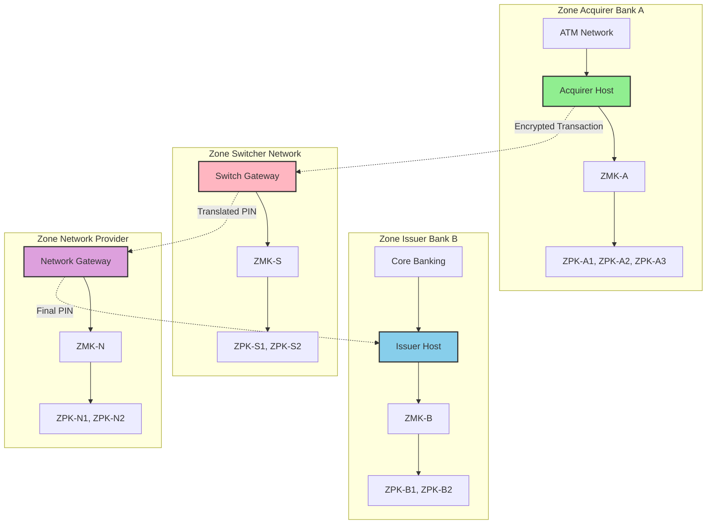

### Alur Transaksi Lintas Zone

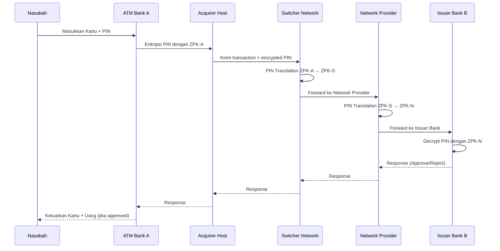

## Arsitektur Zone Key

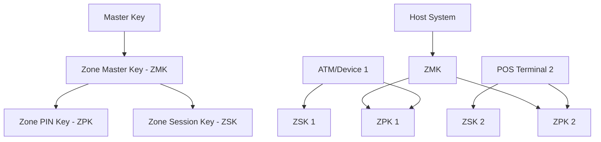

### Pihak-Pihak yang Terlibat dalam Zone Management

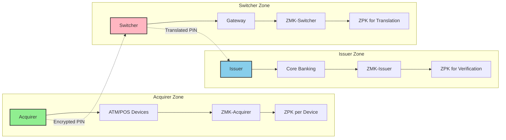

## Zone Master Key (ZMK)

### Konsep
Zone Master Key adalah kunci utama yang digunakan untuk:
- Enkripsi/dekripsi kunci-kunci zone lainnya
- Mengamankan distribusi kunci ke perangkat-perangkat dalam zone
- Memastikan isolasi keamanan antar zone

### Karakteristik
- Panjang: 128-bit (16 byte) atau 192-bit (24 byte) tergantung algoritma
- Triple DES atau AES
- Disimpan dalam HSM dengan proteksi khusus
- Memiliki periode validitas yang panjang

### Cara Kerja
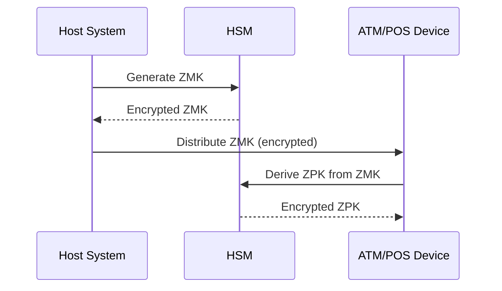

## Zone PIN Key (ZPK)

### Konsep
Zone PIN Key adalah kunci yang digunakan khusus untuk:
- Enkripsi/dekripsi PIN block
- Validasi PIN saat transaksi
- Menyimpan PIN dengan aman dalam transmisi

### Karakteristik
- Panjang: 128-bit (16 byte)
- Triple DES
- Derived dari ZMK
- Memiliki periode validitas terbatas

### Cara Kerja
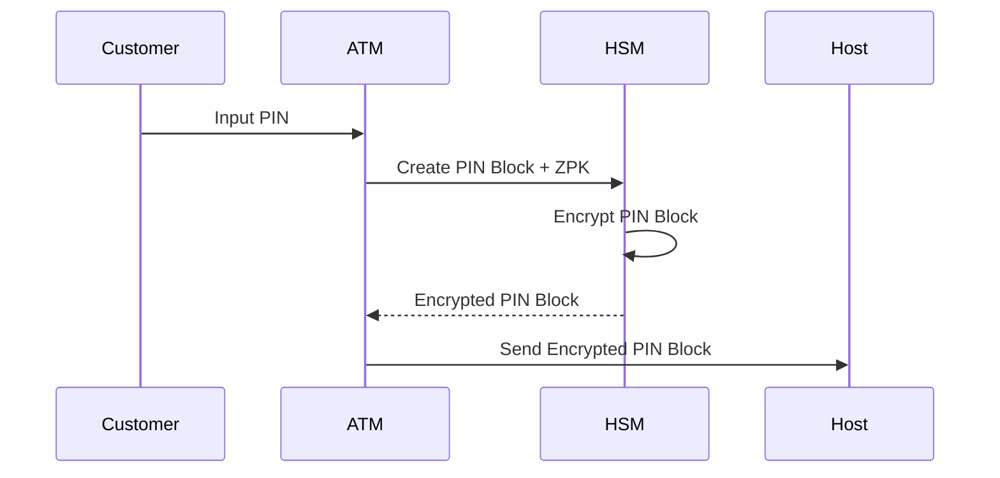

## PIN Translation

### Prinsip Dasar
PIN Translation adalah proses mengubah enkripsi PIN dari satu ZPK ke ZPK lainnya, memungkinkan transaksi lintas zone atau perangkat tanpa mengekspos PIN dalam bentuk plaintext.

### Use Cases
1. **Acquirer to Issuer**: PIN dari ATM perlu dikirim ke bank penerbit kartu
2. **Interchange Networks**: Transaksi antar jaringan pembayaran
3. **Device Migration**: Pindah dari satu perangkat ke perangkat lain

### Proses PIN Translation
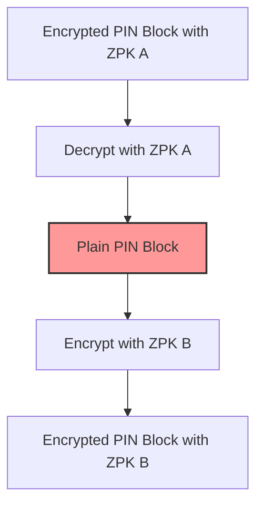

### Format PIN Block
PIN Block biasanya menggunakan format ISO-0:
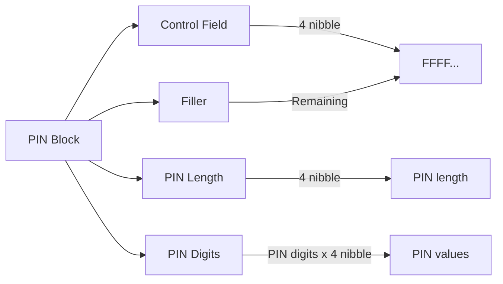

## Simulasi dengan HSM Simulator

### Prerequisites
- HSM Simulator sudah terinstall dan dijalankan
- Browser web untuk mengakses interface web
- Akses ke aplikasi web HSM Simulator (biasanya http://localhost:8080)

### Langkah-langkah Simulasi via Web Interface

#### 1. Setup Zone Master Key
1. Buka browser dan akses http://localhost:8080
2. Login dengan credentials yang telah disediakan
3. Navigate ke menu **Zone Management** → **Zone Master Keys**
4. Klik tombol **Generate New ZMK**
5. Isi form dengan parameter:
   - **Key ID**: `ZMK_001`
   - **Algorithm**: Pilih `3DES` dari dropdown
   - **Key Length**: Pilih `128-bit`
   - **Zone ID**: `ZONE_ACQUIRER_A`
   - **Description**: `ZMK for Acquirer Bank A`
6. Klik **Generate**
7. Simpan ZMK yang dihasilkan (akan ditampilkan dalam bentuk encrypted)

#### 2. Create Zone PIN Key
1. Navigate ke menu **Zone Management** → **Zone PIN Keys**
2. Klik tombol **Generate New ZPK**
3. Isi form dengan parameter:
   - **Key ID**: `ZPK_001`
   - **ZMK Reference**: Pilih `ZMK_001` dari dropdown
   - **Zone ID**: `ZONE_ATM_001`
   - **Device Type**: Pilih `ATM`
   - **Validity Period**: Set 30 hari
4. Klik **Generate**
5. ZPK akan otomatis terencrypt dengan ZMK yang dipilih

#### 3. PIN Encryption Test
1. Navigate ke menu **PIN Operations** → **PIN Encryption**
2. Isi form encryption:
   - **PIN**: Masukkan `1234`
   - **PAN**: Masukkan `1234567890123456`
   - **ZPK ID**: Pilih `ZPK_001` dari dropdown
   - **PIN Block Format**: Pilih `ISO-0` dari dropdown
3. Klik **Encrypt PIN**
4. Hasil encrypted PIN block akan ditampilkan
5. Copy hasilnya untuk testing selanjutnya

#### 4. PIN Translation Test
1. Buat ZPK kedua dengan ID `ZPK_002` untuk target zone
2. Navigate ke menu **PIN Operations** → **PIN Translation**
3. Isi form translation:
   - **Encrypted PIN Block**: Paste hasil dari step sebelumnya
   - **Source ZPK ID**: Pilih `ZPK_001`
   - **Target ZPK ID**: Pilih `ZPK_002`
   - **PAN**: Masukkan `1234567890123456` (sama seperti sebelumnya)
4. Klik **Translate PIN**
5. Hasil PIN block yang terencrypt dengan ZPK target akan ditampilkan

#### 5. PIN Verification Test
1. Navigate ke menu **PIN Operations** → **PIN Verification**
2. Isi form verification:
   - **Encrypted PIN Block**: Gunakan hasil dari step encryption atau translation
   - **ZPK ID**: Pilih ZPK yang sesuai
   - **PAN**: Masukkan `1234567890123456`
   - **Expected PIN**: Masukkan `1234`
3. Klik **Verify PIN**
4. Hasil verification akan ditampilkan (Success/Failed)

### Web Interface Navigation Guide

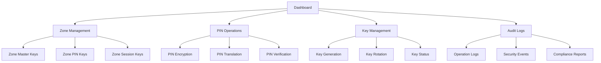

### Scenario Testing

#### Scenario 1: ATM Transaction Flow
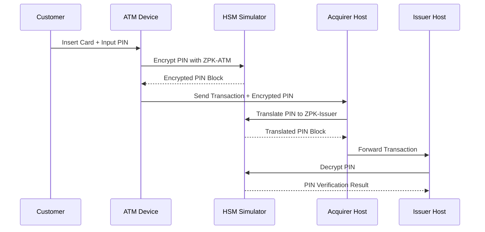

#### Scenario 2: Cross-Zone Transaction
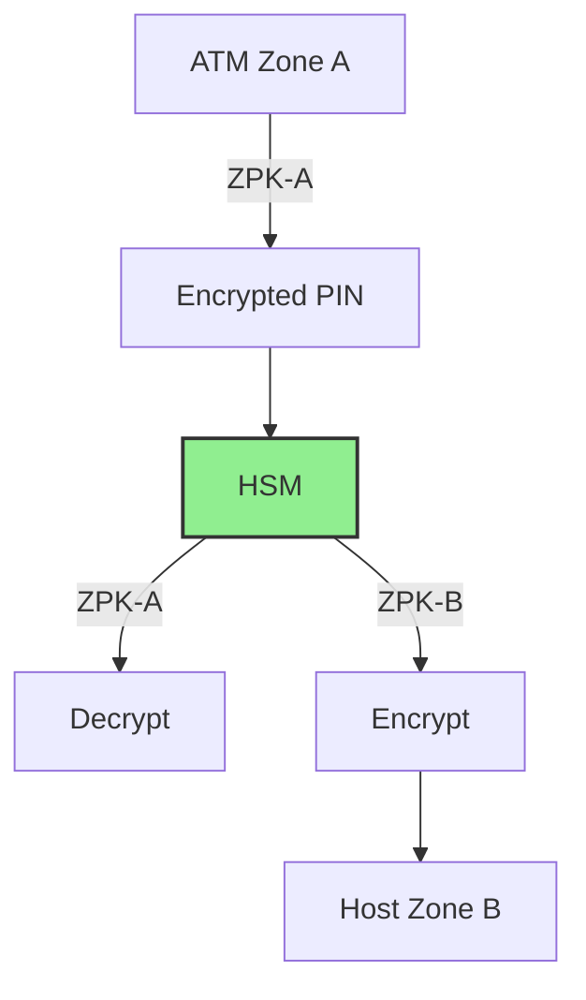

## Security Considerations

### Key Management
- ZMK harus dirotasi secara berkala
- ZPK memiliki validitas terbatas
- Key split mechanism untuk HSM cluster
- Audit log untuk semua operasi kunci

### Network Security
- TLS untuk semua komunikasi dengan HSM
- IP whitelisting untuk akses HSM
- Rate limiting untuk PIN verification attempts

### Monitoring
- Alert untuk PIN translation failures
- Monitoring key usage patterns
- Audit trail untuk semua operasi kunci

## Troubleshooting

### Common Issues
1. **PIN Translation Failed**: ZPK tidak valid atau expired
2. **Key Generation Error**: HSM tidak dapat menghasilkan kunci baru
3. **Network Timeout**: Koneksi ke HSM terputus
4. **Invalid PIN Format**: PAN atau PIN tidak sesuai format

### Debug Steps via Web Interface
1. **Check Key Status**: Navigate ke **Key Management** → **Key Status**
2. **HSM Health Check**: Dashboard → **System Health** → **HSM Status**
3. **Review Logs**: Navigate ke **Audit Logs** → **Operation Logs** atau **Security Events**
4. **Validate Configuration**: **Key Management** → **Configuration Validation**
5. **Performance Monitor**: Dashboard → **Performance Metrics** → **PIN Operations**